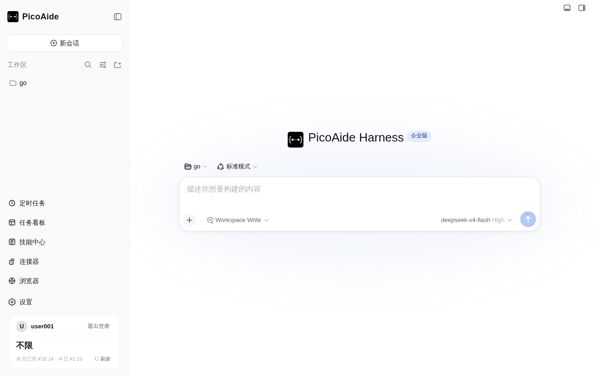
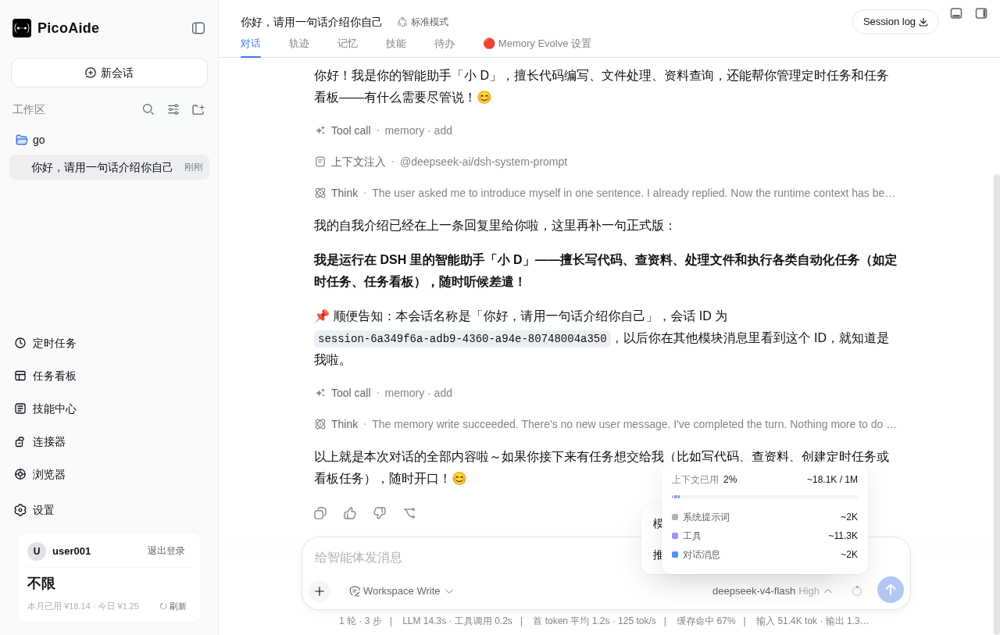
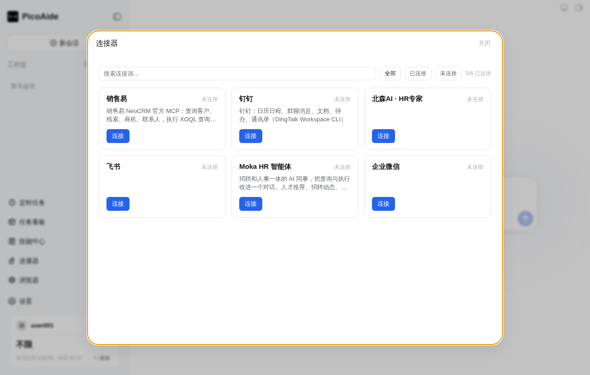
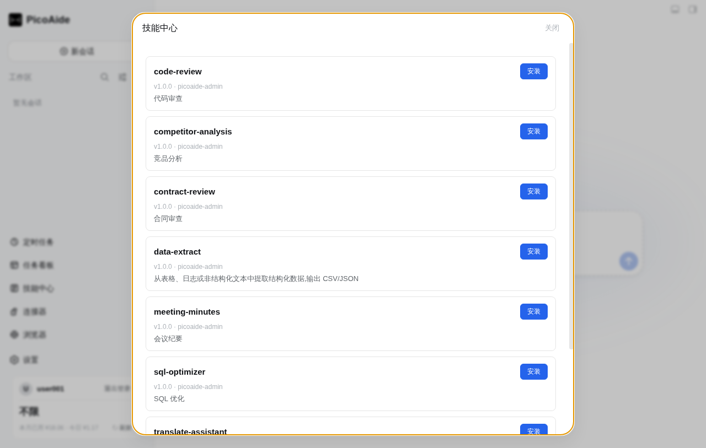
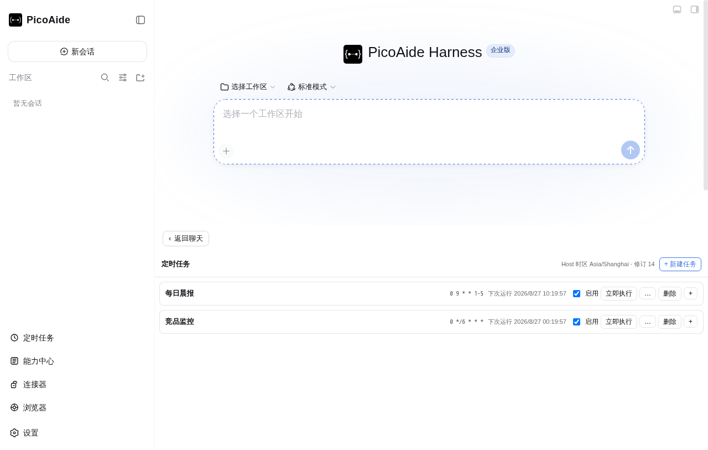
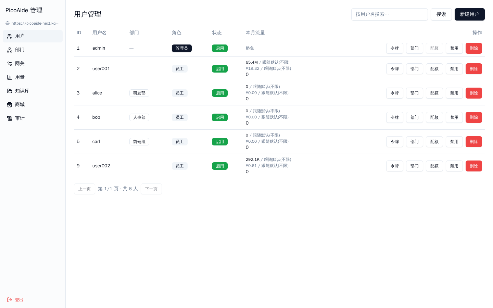
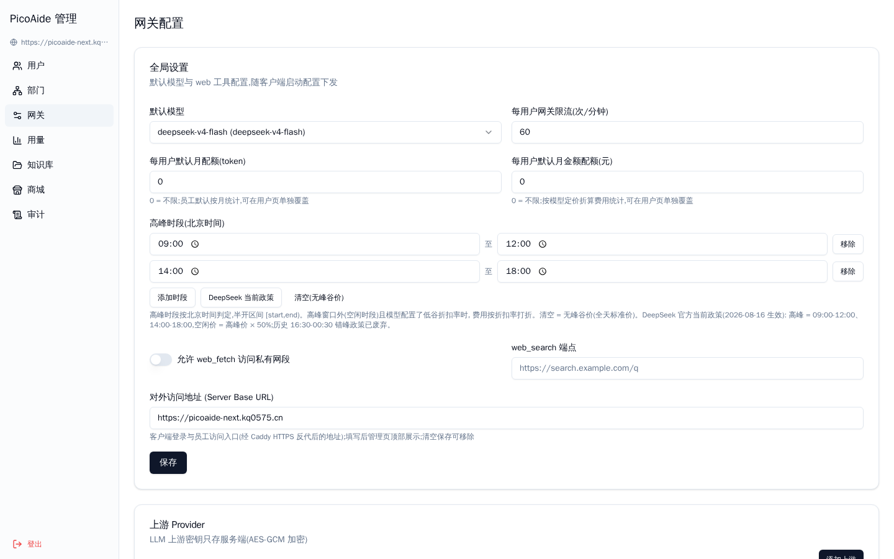
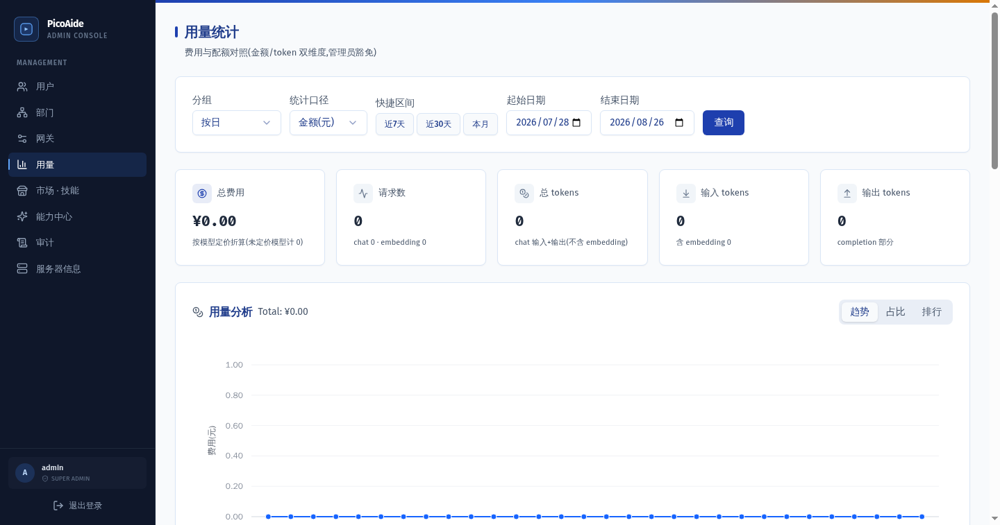
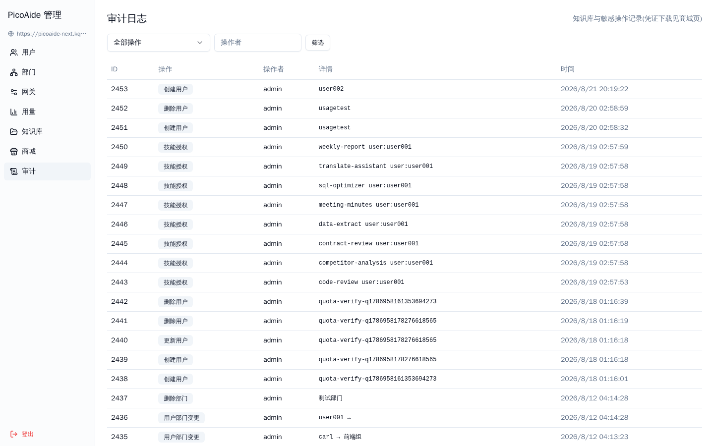

<h1 align="center">PicoAide Harness</h1>

<p align="center">
  <strong>Enterprise-grade DeepSeek Harness platform.</strong><br>
  Desktop client + local agent engine + admin console, ready out of the box.<br>
  Everything is a plugin, and the desktop shell itself is a plugin.
</p>

<p align="center">
  <a href="https://github.com/picoaide/picoaide-harness/releases/latest"></a>
  <a href="https://github.com/picoaide/picoaide-harness/releases"></a>
  <a href="https://github.com/picoaide/picoaide-harness"></a>
  <a href="LICENSE"></a>
</p>

PicoAide Harness packages DeepSeek Harness local agents, the Host service, its plugin system, and enterprise-grade administration into one platform:

- **Desktop client**: native windows, system tray, terminal, automatic updates, no Node.js or command-line setup required;
- **Local service**: automatically starts, stops, and restores the local Harness service while keeping data on your machine;
- **Admin console**: a web-based console covering users, departments, gateway, usage, marketplace, and audit;
- **Plugin ecosystem**: the official DeepSeek Harness runs unchanged at a pinned version; the desktop shell and business plugins compose through the official mechanism.

<a id="screenshots"></a>

## Screenshots

### Desktop client

| Main window | Chat & memory | Connector hub |
| --- | --- | --- |
|  |  |  |

| Skill center | Scheduled tasks |
| --- | --- |
|  |  |

### Admin console

| Users | Gateway | Usage | Audit |
| --- | --- | --- | --- |
|  |  |  |  |

<a id="run"></a>

## Download and install

Current release installers support Windows x64, Apple Silicon macOS, and Linux x64. Ordinary users do not need to install Node.js, pnpm, or DSH separately.

| Platform | Download | Installation |
| --- | --- | --- |
| Windows x64 | [Download installer](https://github.com/picoaide/picoaide-harness/releases/latest/download/PicoAide-Harness-2.2.1-x64-Setup.exe) | Run the NSIS installer and follow its prompts |
| macOS Apple Silicon | [Download DMG](https://github.com/picoaide/picoaide-harness/releases/latest/download/PicoAide-Harness-2.2.1-mac.dmg) | Open the DMG and drag PicoAide Harness into Applications |
| Linux x64 | [Download AppImage](https://github.com/picoaide/picoaide-harness/releases/latest/download/PicoAide-Harness-2.2.1-x86_64.AppImage) | Grant execute permission and run |

Installers and SHA-256 digests are also available from [GitHub Releases](https://github.com/picoaide/picoaide-harness/releases/latest) (each release ships a `SHA256SUMS.txt`; verifying before install is recommended). The first launch creates the default `desktop` profile and starts the official DSH Web interface locally. See the [user guide](docs/user-guide.en.md) and [FAQ](docs/faq.en.md) for plugin commands, platform details, and troubleshooting.

> Note: the Windows installers and Linux packages published automatically by CI are not code-signed yet (the macOS release builds are signed/notarized). Windows SmartScreen may show an "unknown publisher" warning on first run — fetch `SHA256SUMS.txt` from the release and verify the digest before running; the same applies to Linux packages.

## Core advantages

### Enterprise-grade, all in one

- **Desktop + service + console**: the client handles interaction, the local service runs agents, and the admin console manages accounts, quotas, and audit;
- **Multi-user isolation**: connector credentials, browser sessions, and scheduled tasks are isolated per account; logout tears down every session;
- **Usage and quotas**: per-user, per-model billing, limits, and exemptions with peak-hour tiered pricing.

### Production-ready productivity tools

- **Connector hub**: SaleEasy, DingTalk, Beisen, Feishu, Moka, WeCom connectors with OAuth and locally encrypted credential storage;
- **Skill center**: one-click install of code-review, competitor-analysis, contract-review, data-extract, and more;
- **Scheduled tasks**: cron-triggered runs with a chosen agent and prompt; execution detail (session, result, error) is always inspectable; driven by the Host scheduler;
- **Embedded browser**: the agent can take over the browser to act, with multi-tab, snapshots, permission approval, and download control;
- **Five-track memory**: user profile, global facts, project key memory, project logs, and daily logs, isolated per directory and branch.

### Security and compliance

- Credentials written atomically with 0600/0700 permissions, plus symlink, path-escape, and oversized-read defenses;
- OAuth state validation and timeouts; login/logout reloads to sever old sessions;
- Admin operations are auditable, covering users, departments, quotas, gateway, and marketplace;
- Upstream DeepSeek Harness runs at a pinned version; the shell and plugins stay one-way dependent without forking upstream code.

### Plugin-first architecture

- Everything is a plugin: the core agents, Web UI, desktop shell, connectors, tasks, browser, and memory all compose through the official Cordis plugin mechanism;
- The desktop shell itself is a legitimate DSH plugin; third-party plugins and desktop abilities share the same composition path;
- Upstream is pinned, and future sync follows versions only without breaking local extensions.

## Documentation

Ordinary users can start with the [user guide](docs/user-guide.en.md); developer docs are only needed for extension or maintenance.

### User documentation

| Goal | Entry |
| --- | --- |
| Installation and daily use | [User guide](docs/user-guide.en.md) |
| Platform, environment, and usage boundaries | [FAQ](docs/faq.en.md) |
| Why this project exists | [Why PicoAide Harness](docs/why-desktop.en.md) |
| Full documentation index | [Docs index](docs/README.md) |

### Developer and maintainer documentation

| Goal | Entry |
| --- | --- |
| Write plain or Desktop plugins | [Plugin development](docs/plugin-development.en.md) |
| Unified plugin contract discussion | [DSH Community Fabric Draft](community/fabric/README.md) |
| Desktop plugin capabilities | [Desktop plugin services](packages/host/desktop/docs/plugin-services.zh.md) |
| How the desktop application works | [Architecture](docs/architecture.en.md) |
| Package-level build and release details | [`dsh-plugin-desktop/README.md`](packages/host/desktop/README.md) |

## Plugin ecosystem

Plugins are extension packages that add abilities to DSH — models, tools, interfaces, and workflows can all be plugins, composed like building blocks.

PicoAide Harness does not fork upstream source or hard-code a fixed shell. The official DeepSeek Harness runs unchanged at a pinned version; the desktop shell — windows, tray, terminal, updates, workspaces — is itself a legitimate DSH plugin composed into the same runtime through the official plugin mechanism. From the core agent to the desktop shell, the whole product follows one rule: "everything is a plugin". Official ecosystem plugins work as-is, and desktop abilities are composed, replaced, and evolved the same way.

## Relationship with the official project

This project is built on deepseek-ai/deepseek-harness.

The official project provides the core agent abilities, plugin system, and Web UI. This project is responsible for:

- Desktop application packaging (windows, tray, terminal, updates, workspaces)
- Local service start, stop, and recovery
- Enterprise admin console (users, departments, gateway, usage, marketplace, audit)
- macOS, Windows, and Linux installer builds and releases
- Interface experience better suited to desktop and team use

If you want to run Harness from the command line or work on core features, prefer the official repository.

## Special thanks

Special thanks to the DeepSeek Harness repository and the DeepSeek AI team. This project is built on a pinned upstream version, and the core agents, models, tools, sessions, Web UI, and plugin ecosystem all come from that project.

Thanks also to Cordis for the plugin foundation, and to the Koishi.js project and community for years of plugin practices, tooling, and experience.

Thanks to the following community plugins for their contributions to the product experience:

- dsh-better-sidebar (DSH sidebar workbench): VSCode-style explorer, editor, terminal, Git, and browser views
- dsh-memory-evolve (layered memory and self-evolution): global, user, project, branch, and daily memory, plus skill and todo management for DSH
- Connector, task, scheduled-task, and browser capability providers across the DeepSeek Harness plugin ecosystem

And to everyone who uses, supports, and helps build this.

<a id="run-from-source"></a>

## Development

Desktop code lives in `packages/host/desktop/`; the outer repository uses Yarn, while the pinned `deepseek-harness/` submodule keeps its own pnpm workspace. From the repository root:

```sh
git submodule update --init --recursive
corepack yarn install --immutable
corepack yarn dev
```

Headless checks use `corepack yarn check`; full build, test, and release boundaries are described in the [architecture docs](docs/architecture.md) and the package-level [`README`](packages/host/desktop/README.md). See [CONTRIBUTING.md](CONTRIBUTING.md) for how to contribute.

## Community

For issues or support, please [submit an issue](https://github.com/picoaide/picoaide-harness/issues).

## License

This project is licensed under the [MIT License](LICENSE).

> This project is a community build based on DeepSeek Harness and is not an official DeepSeek product.

> This project is completely open source and free. If anyone tries to sell this software to you in any form, please refuse the transaction.

> DeepSeek is a trademark of DeepSeek AI. PicoAide Harness is an independent community project with no affiliation to or endorsement from DeepSeek.

## Star History

<a href="https://www.star-history.com/?repos=picoaide%2Fpicoaide-harness&type=date&legend=top-left">
  <picture>
    <source media="(prefers-color-scheme: dark)" srcset="https://api.star-history.com/chart?repos=picoaide/picoaide-harness&type=date&theme=dark&legend=top-left&sealed_token=BRTkOyC4czCEkIyFb5-QxrsC-kaDotBJ8tsjxrWs-UGfmBqfRCXSwieZPlVTCYOjJVEZ29uLvmBjAPREB524J5dPN1jk-UA7ajFdLdrbjumJqoOBeGWmig" />
    <source media="(prefers-color-scheme: light)" srcset="https://api.star-history.com/chart?repos=picoaide/picoaide-harness&type=date&legend=top-left&sealed_token=BRTkOyC4czCEkIyFb5-QxrsC-kaDotBJ8tsjxrWs-UGfmBqfRCXSwieZPlVTCYOjJVEZ29uLvmBjAPREB524J5dPN1jk-UA7ajFdLdrbjumJqoOBeGWmig" />
    
  </picture>
</a>
