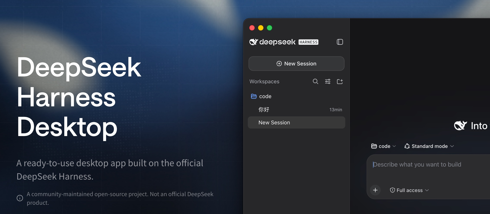

<p align="center">
  
</p>

<p align="center">
  <a href="https://github.com/anywhere-labs/deepseek-harness-desktop"></a>
  
  <a href="LICENSE"></a>
  <a href="https://discord.gg/TJeGqKRNM"></a>
  
</p>

<p align="center"><sub><a href="README.md">中文</a> · English</sub></p>

<h3 align="center">A modern desktop experience for the DeepSeek Harness ecosystem (<a href="#plugin-ecosystem">Plugin</a>)</h3>

<a id="run"></a>

<h3 align="center"><a href="https://www.deepseekdesktop.com"><ins>Download Desktop</ins></a></h3>

<p align="center">
  
</p>

## Documentation

| Goal | Entry point |
| --- | --- |
| Understand why the project exists | [Why DSH Desktop](docs/why-desktop.en.md) |
| Install and use the application | [User guide](docs/user-guide.en.md) |
| Build ordinary or Desktop plugins | [Plugin development](docs/plugin-development.en.md) |
| See what Desktop plugins can use | [Desktop plugin API](dsh-plugin-desktop/docs/plugin-services.md) |
| Understand how the desktop works | [Architecture](docs/architecture.en.md) |
| See the full documentation and README map | [Documentation index](docs/README.en.md) |
| Read package-level build and release details | [`dsh-plugin-desktop/README.md`](dsh-plugin-desktop/README.md) |

## Features

<table>
  <tr>
    <td width="50%" valign="top">
      <h3>Desktop</h3>
      <p>Bring the official DeepSeek Harness local Web UI to a native desktop application. The app starts and manages the local Harness service, integrates the system tray and desktop window, and requires no Node.js installation or command-line setup.</p>
    </td>
    <td width="50%" valign="top">
      <h3>Mobile Remote Control </h3>
      <p>Connect to Desktop from iOS and Android to start tasks, monitor Agent progress, and send follow-ups from your phone.</p>
    </td>
  </tr>
  <tr>
    <td width="50%" valign="top">
      <h3>Plugin Marketplace </h3>
      <p>Harness follows an “everything is a plugin” architecture. The desktop marketplace will make it easy to discover, install, update, and manage plugins for models, tools, interfaces, and workflows.</p>
    </td>
    <td width="50%" valign="top">
      <h3>Channels </h3>
      <p>Connect WeChat, Feishu, Discord, WhatsApp, and other IM channels to start tasks, receive progress updates, and continue conversations from the apps you already use.</p>
    </td>
  </tr>
</table>

## Plugin Ecosystem

DeepSeek Harness turns models, tools, interfaces, and workflows into plugins that can be combined like building blocks. Desktop follows the same idea: it owns the window, tray, and desktop runtime while preserving the official DSH experience for agents, models, tools, sessions, and the Web UI.

Desktop plugin capabilities are now available. Developers can extend the app through two public interfaces: `desktopProfiles` to view and switch work profiles, and `desktopPnpm` to install, update, and remove plugins in the active profile. See the [Desktop plugin API](dsh-plugin-desktop/docs/plugin-services.md) for complete usage details.

Compatibility mode stays close to the official default experience; advanced mode adds a fuller desktop layout and system effects. The plugin marketplace, mobile remote control, and Channels remain future plans and are not part of the current installer.

See [Why DSH Desktop](docs/why-desktop.en.md) and [Plugin development](docs/plugin-development.en.md) for the reasoning and the third-party boundary.

## Relationship to the Official Project

This project is built on [deepseek-ai/deepseek-harness](https://github.com/deepseek-ai/deepseek-harness).

This project is an implementation built on DeepSeek Harness and the Cordis plugin model, intended to provide the foundation for the DSH desktop experience.

The official project provides the core agent capabilities, plugin system, and Web UI. This project primarily provides:

- Desktop application packaging
- Starting, stopping, and recovering the local service
- Desktop window and system tray integration
- macOS and Windows installer builds and releases
- An interface designed for desktop use

If you prefer to run Harness from the command line or contribute to its core functionality, refer to the official repository first.

## Special Thanks

Special thanks to the [original DeepSeek Harness repository](https://github.com/deepseek-ai/deepseek-harness) and the DeepSeek AI team. DSH Desktop is built from a pinned upstream checkout, and its core agents, models, tools, sessions, Web UI, and plugin ecosystem come from that project.

We also thank [Cordis](https://github.com/cordiverse/cordis) for the plugin foundation that makes this composition possible. DSH Desktop would not exist without these open-source projects.

We are also grateful to the [Koishi.js](https://koishi.chat/) project and community for their long-standing work on plugin practices, tooling, and shared knowledge, and to everyone who contributes discussions, testing, feedback, and plugins.

Also, and you.

<a id="run-from-source"></a>

## Development

Desktop source lives in `dsh-plugin-desktop/`. The outer repository uses Yarn, while the pinned `deepseek-harness/` submodule keeps its own pnpm workspace. From the repository root:

```sh
git submodule update --init --recursive
corepack yarn install --immutable
corepack yarn dev
```

Use `corepack yarn check` for the headless gate. The [architecture](docs/architecture.en.md) and package [`README`](dsh-plugin-desktop/README.md) describe the full build, test, and release boundaries.

## Community

Choose whichever platform you prefer to discuss usage, plugin development, and project updates.

<table>
  <thead>
    <tr>
      <th align="center">WeChat Group</th>
      <th align="center">QQ Group</th>
    </tr>
  </thead>
  <tbody>
    <tr>
      <td align="center"></td>
      <td align="center"></td>
    </tr>
  </tbody>
</table>

Discord: [Join the DeepSeek Harness Desktop community](https://discord.gg/TJeGqKRNM)

If you would like to join our technical team, contact us at [t4wefan@qq.com](mailto:t4wefan@qq.com).

## License

This project is licensed under the [MIT License](LICENSE).

> This is a community desktop edition built on DeepSeek Harness. It is not an official DeepSeek product.
