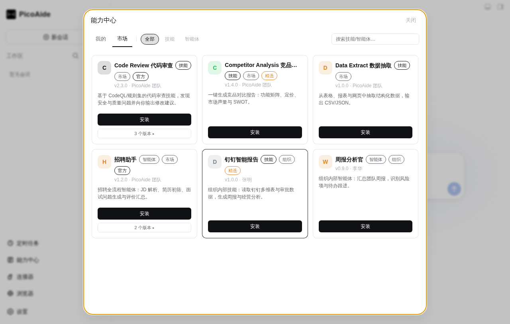
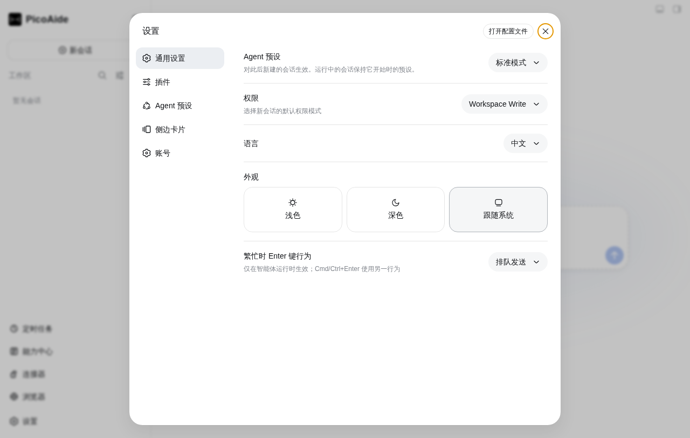
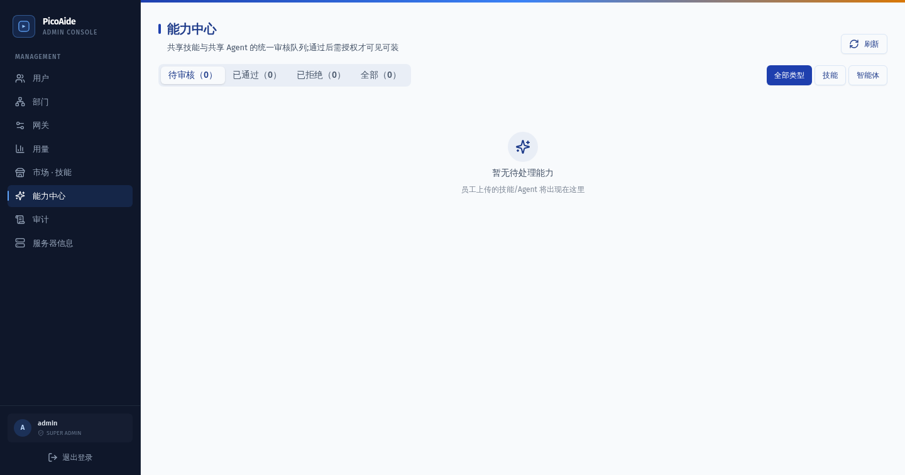
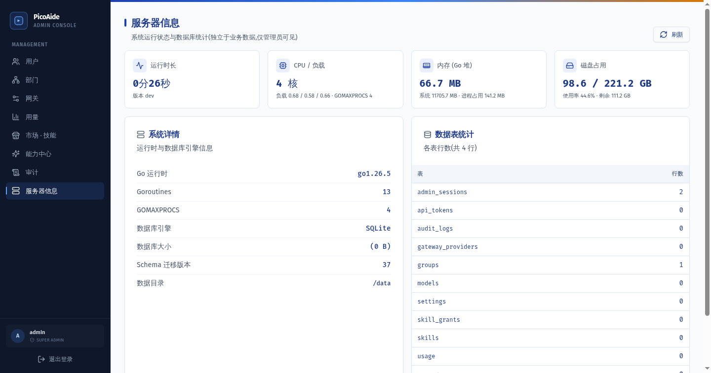

<h1 align="center">PicoAide Harness</h1>

<p align="center">
  <strong>企业级 DeepSeek Harness 一体化平台。</strong><br>
  桌面客户端 + 本地智能体引擎 + 管理后台，开箱即用。<br>
  一切皆插件，桌面本身也是插件。
</p>

<p align="center">
  <a href="https://github.com/picoaide/picoaide-harness/releases/latest"></a>
  <a href="https://github.com/picoaide/picoaide-harness/releases"></a>
  <a href="https://github.com/picoaide/picoaide-harness"></a>
  <a href="LICENSE"></a>
</p>

PicoAide Harness 把 DeepSeek Harness 的本地智能体、Host 服务、插件系统与企业级管理能力装进一个平台：

- **桌面客户端**：原生窗口、系统托盘、终端、自动更新，无需安装 Node.js 或执行命令；
- **本地服务**：自动启动、停止与恢复本地 Harness 服务，数据留在本机；
- **管理后台**：Web 化管理台，覆盖用户、部门、网关、用量、市场与能力中心（共享审批）、审计；
- **插件生态**：官方 DeepSeek Harness 以固定版本原样运行，桌面壳与业务插件通过官方机制组合。

<a id="screenshots"></a>

## 界面预览

### 桌面客户端

| 主界面 | 能力中心 | 连接器中心 |
| --- | --- | --- |
|  |  |  |

| 定时任务 | 设置 |
| --- | --- |
|  |  |

### 管理后台

| 用户管理 | 能力中心 | 网关配置 |
| --- | --- | --- |
|  |  |  |

| 用量统计 | 审计日志 | 服务器信息 |
| --- | --- | --- |
|  |  |  |

<a id="run"></a>

## 下载与安装

当前正式安装包支持 Windows x64、搭载 Apple 芯片的 macOS 和 Linux x64。普通用户不需要单独安装 Node.js、pnpm 或 DSH。

| 平台 | 下载 | 安装方式 |
| --- | --- | --- |
| Windows x64 | [下载安装程序](https://github.com/picoaide/picoaide-harness/releases/latest/download/PicoAide-Harness-2.3.0-x64-Setup.exe) | 运行 NSIS 安装程序并按提示完成安装 |
| macOS Apple Silicon | [下载 DMG](https://github.com/picoaide/picoaide-harness/releases/latest/download/PicoAide-Harness-2.3.0-mac.dmg) | 打开 DMG，将 PicoAide Harness 拖入 Applications |
| Linux x64 | [下载 AppImage](https://github.com/picoaide/picoaide-harness/releases/latest/download/PicoAide-Harness-2.3.0-x86_64.AppImage) | 授予执行权限后运行 |

也可以从 [GitHub Releases](https://github.com/picoaide/picoaide-harness/releases/latest) 获取安装包和 SHA-256 摘要（每个 Release 附 `SHA256SUMS.txt`，安装前建议校验）。首次启动会创建默认 `desktop` profile，并在本机启动官方 DSH Web 界面。详细步骤、插件命令和故障排查见[用户指南](docs/user-guide.md)与[常见问题](docs/faq.md)。

> 说明：CI 自动发布的 Windows 安装程序与 Linux 安装包暂未签名（macOS 正式发布版经签名/公证）。首次运行 Windows 安装包时 SmartScreen 可能提示"未知发布者"，请先在 Releases 下载 `SHA256SUMS.txt` 核对后再运行；Linux 安装包同理。

## 核心优势

### 企业级一体化

- **桌面 + 服务 + 后台**：客户端负责交互，本地服务负责智能体运行，管理后台负责账号、配额与审计，三层协同；
- **多用户隔离**：连接器凭据、浏览器会话、定时任务按账号隔离，退出登录即解除所有会话；
- **用量与配额**：按用户按模型计费、限额与豁免，高峰时段自动分级计价。

### 开箱即用的生产力工具

- **能力中心**：我的 / 市场两分区，技能与智能体类型筛选，来源（市场/组织/本地）与质量（官方/精选）徽章，多版本归并与历史，一键安装/更新/卸载；
- **连接器中心**：内置销售易（NeoCRM）、Moka HR 等 MCP 连接器，OAuth 授权 + PKCE，凭据本地加密存储，动态注册 MCP；
- **定时任务**：cron 定时执行，指定智能体与提示词、工作区与权限，执行详情（会话/结果/错误）随时可查，支持会话跳转，由 Host 统一调度；
- **内嵌浏览器**：Agent 可接管浏览器执行操作，多标签、地址栏、权限审批与下载管控；
- **五轨记忆**：用户档案、全局事实、项目关键记忆、项目日志与每日日志，按目录与 git 分支隔离，确认制写入。

### 安全与合规

- 凭据以 0600/0700 权限原子写入，防符号链接、路径逃逸与超大读取；
- OAuth state 校验与超时控制，登录/登出整页刷新切断旧会话；
- 管理后台操作留痕，审计日志覆盖用户、部门、配额、网关、商店与共享审批操作；
- 上游密钥 AES-GCM 加密存储，API token 只存哈希（90 天过期），改密/降权/禁用自动吊销；
- 上游 DeepSeek Harness 以固定版本运行，桌面壳与插件保持单向依赖，不魔改上游源码。

### 插件优先的架构

- 一切皆插件：核心智能体、Web UI、桌面外壳、连接器、定时任务、浏览器、记忆全部通过官方 Cordis 插件机制组合；
- 桌面壳自身就是合法的 DSH 插件，第三方插件与桌面能力走同一条组合路径；
- 上游固定 pin，后续同步只跟随版本号，不破坏本地扩展。

## 文档

普通用户从[用户指南](docs/user-guide.md)开始即可；开发者文档只在需要扩展或维护时才需要阅读。

### 用户文档

| 目标 | 入口 |
| --- | --- |
| 安装和日常使用 | [用户指南](docs/user-guide.md) |
| 快速确认平台、环境和使用边界 | [常见问题](docs/faq.md) |
| 了解项目为什么存在 | [为什么做 PicoAide Harness](docs/why-desktop.md) |
| 查看全部文档与 README 分工 | [文档索引](docs/README.md) |

### 开发者与维护者文档

| 目标 | 入口 |
| --- | --- |
| 编写普通或 Desktop 插件 | [插件开发](docs/plugin-development.md) |
| 参与统一插件 contract 讨论 | [DSH Community Fabric Draft](community/fabric/README.zh.md) |
| 了解桌面插件可以使用的能力 | [桌面插件接口说明](packages/host/desktop/docs/plugin-services.zh.md) |
| 了解桌面应用如何工作 | [架构说明](docs/architecture.md) |
| 查阅包级构建与发布细节 | [`dsh-plugin-desktop/README.md`](packages/host/desktop/README.md) |

## 插件生态

插件是给 DSH 添加能力的扩展包——模型、工具、界面、工作流都可以做成插件，像搭积木一样自由组合。

PicoAide Harness 没有魔改上游源码，也不是一个固定写死的外壳。官方 DeepSeek Harness 以固定版本原样运行；桌面壳本身——窗口、托盘、终端、更新、工作配置——就是一个合法的 DSH 插件，通过官方插件机制与官方能力组合进同一个运行时。从核心 agent 到桌面外壳，整个产品遵守同一条"一切皆插件"的规则：官方生态里的插件可以直接用，桌面能力也按插件的方式组合、替换和演进。

## 与官方项目的关系

本项目基于 deepseek-ai/deepseek-harness 构建。

官方项目提供核心的智能体能力、插件系统和 Web UI。本项目主要负责：

- 桌面应用封装（窗口、托盘、终端、更新与工作配置）
- 本地服务的启动、停止与恢复
- 企业级管理后台（用户、部门、网关、用量、商城与审计）
- macOS、Windows、Linux 安装包构建与发布
- 更适合桌面与团队使用的界面体验

如果你希望通过命令行运行 Harness，或者参与核心功能开发，请优先查看官方仓库。

## 特别感谢

特别感谢 DeepSeek Harness 原始仓库和 DeepSeek AI 团队。本项目基于固定版本的上游源码构建，核心的智能体、模型、工具、会话、Web UI 和插件生态都来自这个项目。

同时感谢 Cordis 项目提供的插件化基础，以及 Koishi.js 项目和社区长期积累的插件化实践、工具与经验。

感谢以下社区插件为产品体验做出的贡献：

- dsh-better-sidebar（DSH 侧边栏工作台）：提供 VSCode 风格的资源管理器、编辑器、终端、Git 与浏览器视图
- dsh-memory-evolve（分层记忆与自我进化）：为 DSH 带来全局、用户、项目、分支与每日分层记忆，以及技能与待办管理
- DeepSeek Harness 插件生态中的连接器、任务、定时任务与浏览器等能力提供者

以及每一个使用、支持和参与共建的你。

<a id="run-from-source"></a>

## 开发

桌面端代码位于 `packages/host/desktop/`，外层仓库使用 Yarn，固定的 `deepseek-harness/` 子模块继续使用自己的 pnpm workspace。从仓库根目录执行：

```sh
git submodule update --init --recursive
corepack yarn install --immutable
corepack yarn dev
```

headless 检查使用 `corepack yarn check`；完整的构建、测试和发布边界见[架构说明](docs/architecture.md)和包级 [`README`](packages/host/desktop/README.md)。如何参与贡献见 [CONTRIBUTING.md](CONTRIBUTING.md)。

## 社区交流

遇到问题或需要支持，请前往 [提交 Issue](https://github.com/picoaide/picoaide-harness/issues)。

## License

本项目遵循 [MIT License](LICENSE)。

> 本项目是基于 DeepSeek Harness 构建的社区版本，并非 DeepSeek 官方产品。

> 本项目完全开源免费。如果有人向您以任何形式出售此软件，请拒绝交易。

> DeepSeek 是 DeepSeek AI 的商标。PicoAide Harness 是独立的社区项目，与 DeepSeek 官方没有隶属关系，也未获得其背书。

## Star History

<a href="https://www.star-history.com/?repos=picoaide%2Fpicoaide-harness&type=date&legend=top-left">
  <picture>
    <source media="(prefers-color-scheme: dark)" srcset="https://api.star-history.com/chart?repos=picoaide/picoaide-harness&type=date&theme=dark&legend=top-left&sealed_token=BRTkOyC4czCEkIyFb5-QxrsC-kaDotBJ8tsjxrWs-UGfmBqfRCXSwieZPlVTCYOjJVEZ29uLvmBjAPREB524J5dPN1jk-UA7ajFdLdrbjumJqoOBeGWmig" />
    <source media="(prefers-color-scheme: light)" srcset="https://api.star-history.com/chart?repos=picoaide/picoaide-harness&type=date&legend=top-left&sealed_token=BRTkOyC4czCEkIyFb5-QxrsC-kaDotBJ8tsjxrWs-UGfmBqfRCXSwieZPlVTCYOjJVEZ29uLvmBjAPREB524J5dPN1jk-UA7ajFdLdrbjumJqoOBeGWmig" />
    
  </picture>
</a>
