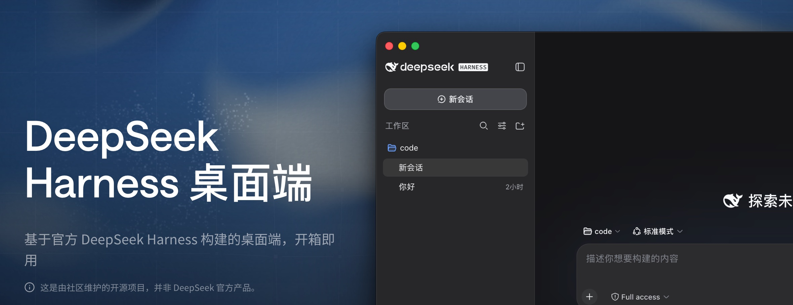

<p align="center">
  
</p>

<p align="center">
  <a href="https://github.com/anywhere-labs/deepseek-harness-desktop"></a>
  
  <a href="LICENSE"></a>
  <a href="https://discord.gg/TJeGqKRNM"></a>
  
</p>

<p align="center"><sub>中文 · <a href="README.en.md">English</a></sub></p>

<h3 align="center">为DeepSeek Harness生态打造的现代化桌面端体验（<a href="#插件生态">插件</a>）</h3>

<a id="run"></a>

<h3 align="center"><a href="https://www.deepseekdesktop.com"><ins>立刻下载 MacOS/Windows</ins></a></h3>

<p align="center">
  
</p>

## 文档

| 目标 | 入口 |
| --- | --- |
| 了解项目为什么存在 | [为什么做 DSH Desktop](docs/why-desktop.md) |
| 安装和日常使用 | [用户指南](docs/user-guide.md) |
| 编写普通或 Desktop 插件 | [插件开发](docs/plugin-development.md) |
| 了解桌面插件可以使用的能力 | [桌面插件接口说明](dsh-plugin-desktop/docs/plugin-services.zh.md) |
| 了解桌面应用如何工作 | [架构说明](docs/architecture.md) |
| 查看全部文档与 README 分工 | [文档索引](docs/README.md) |
| 查阅包级构建与发布细节 | [`dsh-plugin-desktop/README.md`](dsh-plugin-desktop/README.md) |

## 主要功能

<table>
  <tr>
    <td width="50%" valign="top">
      <h3>Desktop</h3>
      <p>把官方 DeepSeek Harness 的本地 Web UI 带到原生桌面。应用自动启动和管理本地 Harness 服务，集成系统托盘与桌面窗口，无需安装 Node.js 或执行命令。</p>
    </td>
    <td width="50%" valign="top">
      <h3>手机远程控制 </h3>
      <p>通过 iOS 和 Android 远程连接 Desktop，在手机上发起任务、查看 Agent 进度，并在需要时继续跟进。</p>
    </td>
  </tr>
  <tr>
    <td width="50%" valign="top">
      <h3>插件市场 </h3>
      <p>Harness 遵循“一切皆插件”的架构。桌面端插件市场将提供插件的发现、安装、更新和管理，让模型、工具、界面与工作流能力按需组合。</p>
    </td>
    <td width="50%" valign="top">
      <h3>Channels </h3>
      <p>接入微信、飞书、Discord、WhatsApp 等 IM 通道，直接在日常聊天工具中向 Agent 发起任务、接收进度并继续对话。</p>
    </td>
  </tr>
</table>

## 插件生态

DeepSeek Harness 把模型、工具、界面和工作流做成可以自由组合的插件，就像积木一样。Desktop 沿用这种方式：它负责窗口、托盘和桌面运行环境，同时保留官方 DSH 的智能体、模型、工具、会话和 Web UI 体验。

Desktop 的插件能力已经可以使用。开发者可以通过两个公开接口扩展桌面端：`desktopProfiles` 用来查看和切换工作配置，`desktopPnpm` 用来在当前配置中安装、更新和移除插件。完整用法见[桌面插件接口说明](dsh-plugin-desktop/docs/plugin-services.zh.md)。

兼容模式尽量保持官方默认体验；高级模式则提供更完整的桌面布局和系统效果。插件市场、手机远程和 Channels 仍是后续规划，不代表当前安装包已经提供这些入口。

为什么选择这样的边界、哪些能力不会暴露给第三方插件，见[为什么做 DSH Desktop](docs/why-desktop.md)和[插件开发指南](docs/plugin-development.md)。

## 与官方项目的关系

本项目基于 [deepseek-ai/deepseek-harness](https://github.com/deepseek-ai/deepseek-harness) 构建。

本项目是基于 DeepSeek Harness 和 Cordis 插件思想的实现，旨在成为 DSH 桌面体验的基础设施。

官方项目提供核心的智能体能力、插件系统和 Web UI。本项目主要负责：

- 桌面应用封装
- 本地服务的启动、停止与恢复
- 桌面窗口和系统托盘集成
- macOS、Windows 安装包构建与发布
- 更适合桌面使用的界面体验

如果你希望通过命令行运行 Harness，或者参与核心功能开发，请优先查看官方仓库。

## 特别感谢

特别感谢 [DeepSeek Harness 原始仓库](https://github.com/deepseek-ai/deepseek-harness) 和 DeepSeek AI 团队。DSH Desktop 基于固定版本的上游源码构建，核心的智能体、模型、工具、会话、Web UI 和插件生态都来自这个项目。

同时感谢 [Cordis](https://github.com/cordiverse/cordis) 项目提供的插件化基础。没有这些开源项目，就不会有 DSH Desktop。

也感谢 [Koishi.js](https://koishi.chat/) 项目和社区长期积累的插件化实践、工具与经验，以及所有参与讨论、测试、反馈和插件开发的社区成员。

And you.

<a id="run-from-source"></a>

## 开发

桌面端代码位于 `dsh-plugin-desktop/`，外层仓库使用 Yarn，固定的 `deepseek-harness/` 子模块继续使用自己的 pnpm workspace。从仓库根目录执行：

```sh
git submodule update --init --recursive
corepack yarn install --immutable
corepack yarn dev
```

headless 检查使用 `corepack yarn check`；完整的构建、测试和发布边界见[架构说明](docs/architecture.md)和包级 [`README`](dsh-plugin-desktop/README.md)。

## 社区交流

可选择常用的平台参与讨论，交流使用问题、插件开发和项目进展。

<table>
  <thead>
    <tr>
      <th align="center">微信群</th>
      <th align="center">QQ群</th>
    </tr>
  </thead>
  <tbody>
    <tr>
      <td align="center"></td>
      <td align="center"></td>
    </tr>
  </tbody>
</table>

Discord：[加入 DeepSeek Harness Desktop 社区](https://discord.gg/TJeGqKRNM)

如果您希望加入我们的技术团队，也欢迎通过 [t4wefan@qq.com](mailto:t4wefan@qq.com) 联系我们。

## 友情链接

这里收录 DeepSeek Harness 生态项目及开发者工具。

| 项目 | 简介 | 链接 |
| --- | --- | --- |
| DeepSeek Harness 橙皮书 | DeepSeek Harness 社区实测手册。 | [GitHub](https://github.com/alchaincyf/deepseek-harness-orange-book) |
| Awesome DSH Plugin | DeepSeek Harness 社区插件精选列表。 | [GitHub](https://github.com/awesome-dsh-plugin/awesome-dsh-plugin) · [官网](https://awesome-dsh-plugin.com) |
| dsh-web-ui | DeepSeek Harness Web UI 插件与皮肤合集。 | [GitHub](https://github.com/zhu1090093659/dsh-web-ui) · [展示站](https://gallery.dsh-market.com) |
| dsh-TUI | DeepSeek Harness 全屏交互式终端界面。 | [GitHub](https://github.com/ccch1mneyyy/dsh-TUI) |
| Agents-Anywhere | 从手机远程控制电脑上的 Coding Agent。 | [GitHub](https://github.com/anywhere-labs/Agents-Anywhere) |
| DSH-better-sidebar | DeepSeek Harness 侧边栏工作台，集成文件、终端、Git 和子代理。 | [GitHub](https://github.com/omdsh-dev/DSH-better-sidebar) |
| Awesome DeepSeek Harness | DeepSeek Harness 插件、工具与基础设施精选列表。 | [GitHub](https://github.com/0xsline/awesome-deepseek-harness) · [官网](https://deepseekdocs.com/) |
| MkSaaS · TanStarter（赞助商） | 面向独立开发者的商业 SaaS 启动模板。MkSaaS 基于 Next.js，TanStarter 基于 TanStack Start 与 Cloudflare，内置 AI、认证、支付和后台等常用能力。 | [MkSaaS](https://mksaas.com) · [TanStarter](https://tanstarter.dev) |

<sub>如果希望收录您的项目，欢迎加入微信群并私信 @王博升Benson。</sub>

## License

本项目遵循 [MIT License](LICENSE)。

> 本项目是基于 DeepSeek Harness 构建的社区桌面版本，并非 DeepSeek 官方产品。

> 本项目完全开源免费。如果有人向您以任何形式出售此软件，请拒绝交易。
