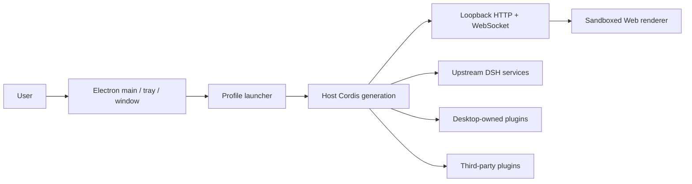

# PicoAide Harness Architecture

## Overview

PicoAide Harness is a thin Electron host. It boots the official DSH Host in the Electron main process; the Host exposes the ordinary Web UI over a loopback HTTP/WebSocket carrier. PicoAide Harness does not create a second renderer IPC plugin system and does not expose raw Electron APIs to the page.

## Startup order

1. Electron acquires the single-instance lock and reads Desktop-owned profile/mode state.
2. The launcher prepares the fixed `desktop` profile without rewriting user profiles merely to list them.
3. The launcher provides the current generation's native runtime and profile repair (installation-owned prefix, third-party bundle order preserved, desktop layer inserted after `dsh-web-app` and never persisted in the bundle list).
4. The Host Cordis root mounts Loader entries; Desktop services register before third-party entries can consume them.
5. The official `dsh-base`, `dsh-web-app`, and the profile's third-party bundles compose the Web carrier.
6. The Host binds a loopback port (random on `127.0.0.1`), and Electron creates the BrowserWindow and loads the same-origin page.
7. The tray is created only after the Web surface loads, and the profile is committed as last-known-good.

The application runs the fixed `desktop` profile with the advanced presentation. Startup-setting changes (such as the local Web port) dispose the current generation before starting the next one. Service references, window objects, and subprocess handles must not be cached across generations.

## Host, Client, and native runtime

- **Upstream Host** owns agent, model, tool, session, settings, webServer, and subprocess capabilities.
- **Desktop Host** owns the window, tray, updates, and diagnostic export; the public plugin surface is `desktopRuntime.registerTrayItem` and the `desktopActions` restart capability (see plugin-services).
- **Web Client** contains the official Web UI and third-party browser contributions. It works over the loopback carrier and does not call Electron directly.
- **Native runtime** adapts the Electron BrowserWindow, tray, filesystem/network operations, and installers. `desktopRuntime` is for Desktop-owned rows only.

The shell is fixed to the advanced presentation: the Client face installs the Desktop-owned layout, frame, and native materials (macOS vibrancy / Windows Mica) while respecting upstream and third-party slot composition. Linux keeps the same advanced layout but uses the standard system window frame (no platform-native Mica or hidden-inset chrome).

## Profile and service boundaries

The launcher manages exactly one fixed `desktop` profile; there is no profile selector and no `web` default. Plugin management uses the official `dsh plugin --profile desktop` semantics from a system shell.

The launcher-private `desktopRuntime`, `desktopPlugins` (profile-bundle disable preview/execute), Electron executable, Node helpers, and ABI environment are not third-party APIs. The supported public contracts are documented in [`dsh-plugin-desktop/docs/plugin-services.md`](../packages/host/desktop/docs/plugin-services.md).

## Packaging and runtime closure

Release artifacts use Electron Builder and `app.asar`, while dependencies that must be physical (for example node-pty, node-addon native files, and Windows ACL/native files) live under `app.asar.unpacked`. The packaged-runtime gate checks both archive entries and physical runtime entries; profile fallback links must not target virtual ASAR paths that Node cannot resolve.

The outer workspace uses Yarn. The pinned `deepseek-harness/` submodule keeps its own pnpm workspace. Desktop source, tests, packaging, and release scripts belong to `packages/host/desktop/`; the upstream submodule is not edited from Desktop branches.

## Maintainer reading

- [Desktop service contract](../packages/host/desktop/docs/plugin-services.md)
- [Package README](../packages/host/desktop/README.md)
- [Pinned upstream and isolated Yarn workspace](../.agents/notes/implemented/process/2026-08-15-pinned-upstream-and-isolated-yarn-workspace.md)
- [Advanced shell decision](../.agents/notes/implemented/architecture/2026-08-15-desktop-advanced-shell.md)
