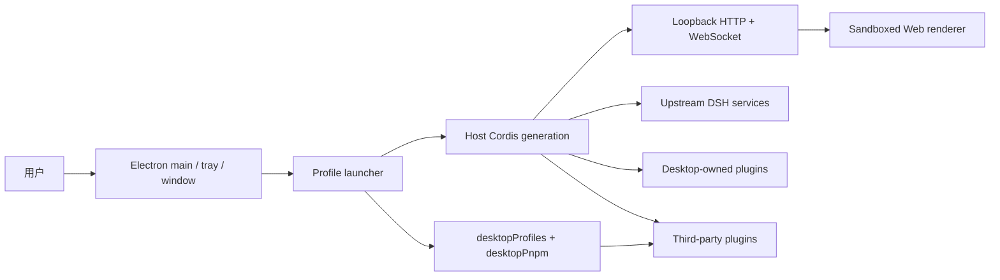

# DSH Desktop 架构

## 总览

DSH Desktop 是一个薄的 Electron 宿主。它在 Electron main 进程中启动官方 DSH Host，Host 再通过 loopback HTTP/WebSocket 提供普通 Web UI。Desktop 没有另造一条 renderer IPC 插件系统，也不把 Electron API暴露给页面。

## 启动顺序

1. Electron 获取单实例锁，并读取 Desktop 私有的 profile/mode 状态。
2. Launcher 准备激活 profile，但不会为了列举 profile 而改写用户 profile。
3. Launcher 提供当前 generation 的 native runtime、`desktopProfiles` bootstrap 和内置 pnpm 环境。
4. Host Cordis root 启动 Loader entries。Desktop service 在第三方插件可读取前注册。
5. 官方 `dsh-base`、`dsh-web-app` 和 profile 中的第三方 bundle 组成 Web carrier。
6. Host 绑定 loopback 端口，Electron 创建 BrowserWindow 并加载同源页面。
7. Web surface 成功加载后才创建托盘并提交 profile 的 last-known-good 状态。

任何 profile 或模式切换都会 dispose 当前 generation，再启动新的 generation。Service reference、窗口对象和 subprocess handle 都不能跨 generation 缓存。

## Host、Client 和 native runtime

- **Upstream Host**：agent、model、tool、session、settings、webServer 和 subprocess 等官方能力。
- **Desktop Host**：窗口、托盘、profile、终端、更新，以及对第三方开放的两个 service。
- **Web Client**：官方 Web UI 和第三方浏览器界面。它通过 loopback carrier 工作，不直接调用 Electron。
- **Native runtime**：Electron BrowserWindow、系统托盘、文件/网络/安装器适配。`desktopRuntime` 只供 Desktop 自有 row 使用。

兼容模式的 Client face 校验环境后直接返回，不注册 Desktop layout、root、sidebar 或 conversation override。高级模式才安装 Desktop-owned layout、frame 和原生材质，同时尊重上游和第三方 slot 组合。

## Profile 与服务边界

profile 的名字和绝对目录由 `desktopProfiles.current` 提供，不能从 argv、settings 或 URL 猜测。`list()` 是只读发现；`select()` 记录 pending target，并通过重启完成切换。

`desktopPnpm.run()` 直接跑内置 pnpm；`runPlugin()` 通过打包的 DSH CLI 维持 profile 初始化、相对 source 和 bundle reconcile。两者都属于当前 generation，并由 subprocess service 管理完整进程树。

Launcher 私有的 `desktopRuntime`、`desktopPnpmBootstrap`、Electron executable、Node helper 和 ABI 环境不是第三方 API。公开 contract 只有 `dsh-plugin-desktop/profile-service` 与 `dsh-plugin-desktop/pnpm`。

## 打包与运行时闭包

发布包使用 Electron Builder 和 `app.asar`，但需要物理 unpack 的依赖（例如 pnpm、node-pty、Windows ACL/native 文件）会放在 `app.asar.unpacked`。Packaged runtime gate 会检查 ASAR 入口和物理运行时入口，profile fallback 不能把符号链接指向无法被 Node 解析的虚拟 ASAR 路径。

根 workspace 使用 Yarn；固定的 `deepseek-harness/` 子模块保持上游自己的 pnpm workspace。桌面代码、测试、打包配置和发布脚本属于 `dsh-plugin-desktop/`，不修改上游子模块。

## 维护者深入阅读

- [Desktop service contract](../dsh-plugin-desktop/docs/plugin-services.md)
- [Package README](../dsh-plugin-desktop/README.md)
- [Pinned upstream and isolated Yarn workspace](../.agents/notes/implemented/process/2026-08-15-pinned-upstream-and-isolated-yarn-workspace.md)
- [Profile and pnpm services decision](../.agents/notes/implemented/architecture/2026-08-15-desktop-profile-and-pnpm-services.md)
- [Advanced shell decision](../.agents/notes/implemented/architecture/2026-08-15-desktop-advanced-shell.md)
