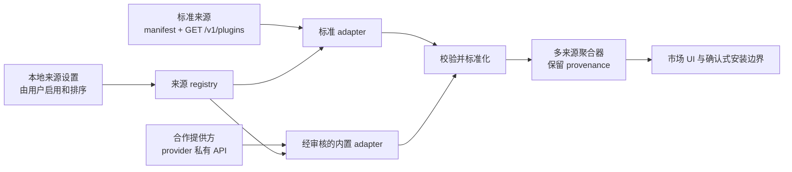

# 目录提供方契约

[English](catalog-provider-contract.md)

状态：**Draft / 实现交接稿**。生成类型、校验、来源持久化、受限网络访问、标准与 DSH 1024Store adapter，以及可加载 Host/Client 入口已实现并进入集成测试。它仍是 private draft，不提供兼容性承诺。

## 决策摘要

- DSH Community Market **没有默认、优先或兜底目录来源**。
- 用户明确添加或选择来源，决定启用哪些来源，并控制它们的展示顺序。
- 用户可以添加任何符合本契约的来源。添加来源不会安装插件，也不会给该来源任何执行能力。
- DSH 1024Store 是当前与本项目合作的目录提供方之一。市场已包含经过审核的内置 adapter；这个 adapter 不会自动启用 1024Store，不会把它排在前面，也不会在其他来源失败时用它兜底。
- 某个来源出现在内置选项中或受到 adapter 支持，不代表 Anywhere Labs 推荐、审核或背书该来源及其收录的插件。
- 所有 provider 必须先转换成同一个标准化模型，数据才能到达市场界面或安装边界。

这些是产品与信任边界，不是后续团队为了实现方便就可以修改的默认值。

## 范围

本契约定义：

- 标准目录如何用静态来源 manifest 描述自己；
- 标准 HTTP endpoint 的查询方式；
- wire format 不同的合作提供方如何通过内置 adapter 接入；
- 市场消费的标准化快照；
- 来源选择、排序、聚合、溯源和失败行为；
- 最小网络与数据安全边界；
- 第一版实现的交接清单和测试矩阵。

它不定义目录治理、插件审核、账号系统、付费、任意鉴权来源或 package 安装命令。安装仍然是独立的用户确认操作，由 Market Host 和当前 profile 服务负责。

## 术语

| 术语 | 含义 |
| --- | --- |
| 目录来源（catalog source） | 插件元数据的提供方；它提供数据，不是可执行插件代码。 |
| 来源 manifest | 描述标准来源及其查询能力的静态 JSON 声明。 |
| Provider ID | Provider 声称的稳定 ID；它是来源声明数据，不是本地权威身份。 |
| Source record ID | Host 为一条本地来源注册生成的不透明 UUID；cache、cursor、聚合和条目身份都使用该 ID。 |
| Adapter | 经过审核的本地代码，用于请求 provider 并把响应转换成标准化模型。 |
| 标准 adapter | 面向直接实现本契约的来源的内置 adapter，不包含 provider 私有逻辑。 |
| Provider adapter | 面向已有不同 API 的合作提供方的、经过审核的内置 adapter。 |
| Provider page | 标准来源返回的不可信 wire response，此时尚未注入 Host provenance。 |
| 标准化快照 | 聚合器、UI 和安装候选解析器唯一可以消费的目录数据结构。 |
| 远程图标候选 | `media.icon` 中由 provider 可选声明的 HTTPS 图片。它是 Host 媒体解析器的不可信输入，绝不是 Renderer 可以直接访问的 URL。 |
| Asset reference | 标准化 `media.icon` 中由 Host 管理的不透明 token。Renderer 只能通过 Host asset 边界消费它，不能把它变成任意网络请求或文件系统路径。 |
| 本地来源设置 | 用户拥有的启用状态和顺序；这些值绝不来自远程 manifest。 |

## 来源必须由用户明确选择

来源选择属于本地用户状态。每条注册都会获得 Host 生成的 `sourceRecordId`；远程 `providerId` 不能替代它，也不能靠匹配已知字符串获得内置/合作方 badge。来源管理界面必须支持：

1. 通过 manifest URL 添加标准来源；
2. 选择已知的内置 provider adapter；
3. 分别启用和停用每个来源；
4. 调整已启用来源的顺序；
5. 删除用户添加的来源；
6. 在信任其数据前看到 provider 名称、来源声明、endpoint host、adapter 类型和最近结果。

Manifest 不能把自己声明成已启用、第一位、可信、官方、推荐或兜底来源。来源 schema 会有意拒绝 `enabled`、`order`、`priority`、鉴权材料、自定义 header、script 和 install command。内置来源与用户来源可以声称同一 `providerId`，但不会共享身份、cache、cursor、信任或展示权重。是否显示经审查的合作方 badge，由本地 adapter 注册决定，不由 provider 声称决定。

首次运行时，市场可以展示可选来源，包括合作提供方，但不能预选它们。没有启用任何来源时，UI 显示明确的“选择或添加来源”状态，不发送目录请求，也绝不静默切换到 DSH 1024Store 或任何其他 provider。

修改来源顺序只影响展示，不影响信任、校验、安装权限或冲突处理。

第一版实现可以持久化以下私有结构（网络输入绝不接受该结构）：

```ts
interface LocalSourceRecord {
  sourceRecordId: string // Host 生成 UUID
  registrationKind: 'user-added' | 'built-in'
  adapterId: string
  providerId: string // provider claim，绝不是本地权威身份
  manifestUrl?: string // 仅 user-added
  manifest?: CatalogSourceManifest // 仅 user-added，保存已校验的注册时披露信息
  builtInProviderKey?: string // 仅 built-in
  enabled: boolean
  order: number
}
```

`manifestUrl` 与 `builtInProviderKey` 必须且只能存在一个。User-added 记录还会保留注册时校验过的 manifest，让 UI 在启用前展示名称、来源声明、endpoint 与 adapter 类型；每次读取目录时，标准 adapter 仍会重新获取并校验远程 manifest。新增记录以 `enabled: false` 开始，启用它是另一次用户确认。

## 三层契约



### 第一层：来源 manifest

标准来源发布一份静态 manifest，并由 [`catalog-source.schema.json`](schemas/catalog-source.schema.json) 校验。Draft v1 的结构用于声明：

- `manifestVersion`，本草案固定为 `1.0.0`；
- provider 声称的 `providerId`、可读 `name`，以及可选 description/homepage；
- 包含名称、URL 和可选 notice 的 provider 来源声明；
- 一个公开的 `https-json` GET endpoint；
- 支持的 query 参数、默认和最大分页大小，以及支持的排序值。

Manifest 描述 provider 能力，不控制本地策略。Draft v1 只支持公开匿名来源：不包含 bearer token、cookie、request header、secret 字段、可执行 mapping 或动态 JavaScript。

来源 manifest URL 与目录 endpoint 是两个不同地址。添加 manifest URL 必须来自用户明确操作。Host 生成全新 `sourceRecordId`，校验 manifest 后将注册时副本与该本地用户来源记录一起保存，在来源管理中展示其披露字段，并在用户启用前保持停用。

注册同时固定 provider 声明与网络 origin。每次请求都必须重新确认 manifest 的 `providerId` 与本地来源记录保存的值完全一致。用户确认的 manifest URL、manifest 请求的最终 URL、`transport.endpoint` 和 provider-page 请求的最终 URL 必须始终属于同一个无凭据 HTTPS origin。Draft v1 的网络 URL 和 manifest 只允许标准 HTTPS 443 端口，不把自定义端口纳入标准来源契约。允许同源 redirect；即使两个地址都使用 HTTPS，也必须拒绝跨 origin。确实需要独立 API origin 或端口的部署，在未来契约版本明确描述这种关系之前，必须使用经过审核的 provider adapter。

### 第二层：adapter

Adapter 是本地的类型化边界，只承担一个职责：在 Host 限制下请求来源，并返回标准化快照。

```ts
interface CatalogAdapter {
  readonly adapterId: string
  fetch(query: CatalogQuery, context: CatalogFetchContext): Promise<CatalogSnapshot>
}
```

`CatalogFetchContext` 应只提供 `AbortSignal`、受限 HTTP client、已校验来源身份、配置限制，以及一个只接受已审核候选并返回不透明 asset reference 的窄 Host media registrar。它不能暴露 Electron 全局对象、任意文件系统访问、shell、ambient credentials 或包管理器执行能力。

标准 adapter 把下文 query 契约映射到标准 endpoint，用 [`catalog-provider-page.schema.json`](schemas/catalog-provider-page.schema.json) 校验 wire response，之后才创建标准化快照。Provider adapter 可以翻译字段名、分页、分类、媒体候选或旧响应字段，但必须返回相同的标准化模型，并保留 provider 来源声明。Provider adapter 随市场 package 一起编译和审核；manifest 或 response 绝不能下载或提供 adapter 代码。

Provider 输入绝不提供 Host provenance。Response 成功后，adapter 注入本地 `sourceRecordId`、本地注册的 `adapterId` 与 registration kind、Host 观测的 `fetchedAt` 和已校验最终 response URL。Provider 生成时间与 revision 必须明确标注为 provider claim。

### 第三层：标准化模型

每个成功结果都必须先通过 [`catalog-snapshot.schema.json`](schemas/catalog-snapshot.schema.json) 校验，之后才能缓存、聚合、展示或用于生成安装候选。

Draft v1 标准化快照包含：

- `schemaVersion: "1.0.0"`；
- Host 生成的来源记录身份、provider claim、本地 adapter 身份、registration kind、观测的抓取时间和最终 URL；
- 可选 provider 生成时间和 revision，它们与 Host 观测值明确分开；
- 标准化插件条目；
- 带可选不透明 next cursor 和 total 的分页信息。

每个条目都有稳定的来源内身份、展示文本和由 Host 注入的明确 provenance。它可以声明 npm package、规范化 repository 加可选 subdirectory，或同时声明两者；也可以包含有界的描述元数据、分类、capability、兼容性声明、更新时间和 Host 已解析的媒体。条目绝不包含 install command、shell fragment、HTML、script、可执行 callback、远程媒体 URL 或文件系统路径。

同一页 provider response 中，每个条目的 `id` 必须唯一。Adapter 必须在注入 provenance 之前拒绝重复 ID。标准化快照中的每个 `provenance.itemId` 必须与所在条目的 `id` 完全一致。

Host 必须确认快照和每个条目 provenance 都携带本地记录的 `sourceRecordId` 与 provider claim。Provider 不能提供这些 Host 字段、冒充内置注册，或靠选择同一 `providerId` 与其他注册冲突 cache 和 cursor。

### 媒体与图标解析

媒体有两种刻意不同的表示形式：

- 标准 provider page 可以声明可选的 `media.icon: { url, alt? }`。URL 是一个不可信的 HTTPS 插件图标候选，还不是可以直接展示的数据。
- 标准化快照可以包含可选的 `media.icon: { assetRef, role, alt? }`。`assetRef` 是 Host 管理的不透明 token，既不是远程 URL，也不是文件系统路径。当前 Host token 的格式是 `mktimg_` 加 32 个 URL-safe 字符；provider 绝不能生成或返回这个 token。`role` 只能是 `plugin-icon` 或 `publisher-avatar`。

Host 在输出标准化快照之前，会通过专用媒体边界校验并登记远程候选，再用新的 `assetRef` 替换它；只有 Renderer 请求该引用时才会懒加载图片字节。对于标准来源，候选必须与 provider-page 的最终 response 同源，每次 redirect 也必须留在 Host 批准的精确 hostname 内；如果提供方使用独立图片 CDN，就必须从目录同源地址提供或代理标准 v1 图标。Asset 服务复用目录请求的目标地址与 redirect 防护，限制图片 media type、字节数和像素数，解码图片，并且只返回安全的本地表示。图片无效或加载失败时，该引用会变为不可用，但不影响其余合法目录条目；Renderer 改用本地占位图。Renderer 不能收到或直接请求 provider URL。

Host 的目录 cache、已注册媒体引用、解码图片 cache 和并发图片任务都必须有界。停用或删除来源时，Host 会在本地来源变更成功保存后，取消其进行中的目录任务、删除 last-good 目录记录，并撤销该来源的全部媒体引用。

同一来源 variant 内的展示优先级固定为：

1. 有效的 provider 直接 `media.icon`，标准化为 `role: "plugin-icon"`；
2. 经审核的 provider adapter fallback，并标记真实角色，例如 `role: "publisher-avatar"`；
3. 标准化条目没有媒体时，由 client 生成本地占位图。

Adapter 不能把 owner 或组织头像冒充成插件图标。这个优先级在 Host 选择登记哪个候选时生效；如果选中的图片之后加载失败，会改用本地占位图，而不会继续联系第二个远程候选。Provider 直接媒体不能在聚合时覆盖另一个来源 variant；provenance 与冲突仍按下文保留并展示。

## 标准 HTTP 来源

标准 v1 来源暴露 manifest 中声明的绝对 HTTPS endpoint。它的 path 为 `/v1/plugins`；如果服务挂载在固定前缀下，也必须以该 path 结尾，并且 endpoint 本身不能带 query 或 fragment：

```text
GET https://catalog.example.org/v1/plugins?q=memory&capability=storage.local&limit=20&locale=zh-CN
Accept: application/json
```

Host 先构造并校验 [`CatalogQuery`](schemas/catalog-query.schema.json)，然后只序列化来源 manifest 的 `query.supported` 数组中声明的参数。缺失值直接省略，不能序列化为空字符串或 `null`。

| 参数 | 数量 | Draft v1 语义 |
| --- | --- | --- |
| `q` | 0 或 1 个 | 去除首尾空白的搜索文本，1–200 个字符；匹配和排序方式由 provider 决定。 |
| `category` | 0 或多个 | 稳定 category ID。重复参数表示“匹配任意一个请求分类”；不允许重复值。 |
| `capability` | 0 或多个 | Fabric/host capability ID。重复参数表示条目必须声明全部请求 capability；不允许重复值。 |
| `cursor` | 0 或 1 个 | 同一来源在相同有效 filter 和 sort 下返回的不透明 continuation value，最长 2048 字符。 |
| `limit` | 0 或 1 个 | 1 到 100 的整数。Host 标准化 query 默认值为 20；有效请求值不能超过 manifest `maxLimit`。 |
| `sort` | 0 或 1 个 | `relevance`、`updated`、`name` 或 `downloads` 之一，并且来源 manifest 也必须声明支持该值。 |
| `locale` | 0 或 1 个 | 类 BCP 47 语言标签，例如 `zh-CN` 或 `en`。它只是偏好，provider 仍必须返回稳定 ID。 |

`category` 和 `capability` 序列化为重复 query 参数，其余字段都是单值。Query 文本和值必须由平台 URL builder 作为数据进行 URL encode，不能直接拼接进 URL、header 或命令。

Host 标准化 query 默认值和 provider 默认值是两个概念。来源支持 `limit` 时，Host 发送用户请求值或标准化默认值 20，并在需要时收窄到 `maxLimit`。来源不支持 `limit` 时，Host 省略该参数，来源通过 `defaultLimit` 声明自己会返回的 page size。Manifest 必须保证 `defaultLimit` 小于或等于 `maxLimit`。

Cursor 只属于一个来源和一个有效 query。聚合器不能把一个来源的 cursor 发送给另一个来源；修改 filter、sort 或来源顺序后，现有聚合分页会话失效。

当前 Desktop 产品路径只读取每个已启用来源的第一页。Schema 与标准 adapter 会在返回的 snapshot 中保留 `page.nextCursor`，但当前 Host route 不接受带来源作用域的 cursor，Client 也尚未提供跨来源的**加载更多**。Provider 现在可以返回 `nextCursor` 以便后续兼容，但当前 UI 不会继续请求它。完整的 per-source cursor session 仍是后续项，并且必须遵守上面的隔离规则；绝不能把一个来源的 cursor 广播给所有已启用来源。

标准来源只有返回通过 provider-page schema 的成功 JSON response 才能接受。Adapter 随后注入 Host provenance，再校验标准化 snapshot schema。超时、非 200、错误 content type、响应过大、解析失败、不支持的 schema version 或任一校验错误只会让该来源请求失败，不影响应用启动。标准 response 条目数超过有效 `limit` 时也必须拒绝。

## 多来源聚合

聚合器处理彼此独立的来源结果，不假设存在一个全局目录：

- 对已启用来源进行有并发上限的并行请求。
- 每个来源拥有独立 timeout、cancellation、cache entry、cursor、loading state 和 error state。
- 一个来源失败时，其他来源的有效结果不会被丢弃。UI 继续展示可用条目，并为失败来源显示简洁错误和重试状态。
- 停用或删除来源会取消该来源的 in-flight 工作并移除结果，不需要重启 DSH。
- 用户选择的来源顺序只决定来源分区和确定性的同分排序。
- 每个 card、详情、搜索结果和安装确认都保留可见的来源声明。

条目的规范身份是 `{ sourceRecordId, itemId }`。即使属于同一 provider，两条注册也保持独立，并且完全可以对同一个插件给出不同描述。只有满足以下条件之一时，Host 才可以创建展示分组：

1. npm package 规范身份相同；或
2. 规范 repository URL 和 subdirectory 都相同。

分组不等于合并。每个 variant、provenance record、兼容性声明、版本、描述和来源声明都必须保留。任何来源都不能静默覆盖另一个来源的声明。仅名称、repository 名称或描述相似绝不足以去重。

如果分组中的 variant 互相冲突，UI 应展示冲突并让用户选择使用哪一条来源记录。来源顺序不能把冲突变成隐式的安全或安装决定。

## 与 DSH 1024Store 的合作

[DSH 1024Store](https://github.com/imsai-sh/awesome-deepseek-harness-plugins) 是当前与 DSH Community Market 合作的提供方之一。它现有的 registry API 不需要为了本草案而修改。接入方式是一份经过审核的内置 provider adapter，它会：

- 在相同 Host 网络限制下请求该 provider 公开文档中的 API；
- 把其分类和插件元数据映射成标准化快照；
- 只把 provider item `id` 当作来源内部身份，并从经过校验的 repository URL 推导规范 GitHub 仓库与 publisher 身份，避免仓库改名或转移后继续指向旧名称；
- 由于当前 1024Store 数据集没有直接插件图标，仅把 GitHub owner/avatar 候选作为经过审核的 fallback，通过 Host 媒体边界解析，并将结果标为 `role: "publisher-avatar"`；
- 注入并校验 DSH 1024Store 的 provenance 和来源声明；
- 永远不把远程 command 文本或安装提示当作可执行输入；
- 在 provider 不可用或数据非法时独立失败。

这一合作关系使 1024Store 成为一个受到支持的来源选项，但**不会**使它成为默认、优先、官方、推荐、已审核或兜底来源。Adapter 不会自动启用它；空来源列表或来源失败也不会触发对它的隐藏请求。它的目录仍属于独立项目，收录某个插件不等于完成了该插件的安全审核。

## 安装边界

目录浏览与插件安装是两个独立操作：

- 获取 manifest 或 snapshot 是只读操作，绝不会调用 pnpm、DSH、shell 或 lifecycle script。
- 远程数据不能提供 install command、自定义包管理器参数、环境变量或工作目录。
- 浏览记录还不是安装目标。Host 必须独立把 npm identity 解析为精确 SemVer 版本，或把 repository identity 解析为不可变 commit，并使用语义化版本解析器而不是正则表达式。
- 一个记录同时声明 npm package 和 repository 时，它们只是 provider 提供的两项独立声明：任何一项都不能静默优先，同时存在也不能证明两者包含相同代码。用户必须明确选择要安装的 identity；Host 无法独立验证两者关系或发现冲突时，安装保持禁用。
- 无法解析并重新校验不可变版本或 commit 时，安装保持禁用。
- 最终确认必须展示精确来源记录、已锁定 package 版本或 repository commit、当前 profile 和本地代码风险提示。
- 只有用户明确操作后才开始安装，并使用现有的受管当前 profile 服务。

支持一个来源只表示可以浏览它的元数据，不会授予该来源安装、更新、启用或执行插件的能力。

## 安全要求

### 网络边界

- 生产环境中的 manifest 和目录 URL 必须使用 HTTPS。拒绝 URL credentials、fragment、非标准 scheme，以及 endpoint 自带 query 的情况。
- 校验每次 redirect，限制 redirect 次数，拒绝 HTTPS downgrade，并在每一跳重新执行全部地址检查。
- DNS 解析后阻止 loopback、private、link-local、multicast、unspecified、运营商级 NAT 和 cloud metadata 地址，并保护连接不受 DNS rebinding 影响。仅可提供明确、可见且生产 build 不存在的本地开发 override。
- 不附带 ambient cookie、authorization header、client certificate 或 provider 提供的自定义 header。Draft v1 来源只支持公开匿名访问。
- 设置 connect、first-byte 和 total deadline，并支持 `AbortSignal` 取消。
- 限制压缩后与解压后 response 大小、条目数量、分页深度、字符串、数组和 URL 长度。限制值必须是有测试的常量；数据字段以 schema maximum 为准。
- 目录 response 必须使用 JSON media type，只解码一次，校验后才能缓存。目录 loader 绝不跟随数据中发现的 URL；只有明确的 Host 媒体解析器可以在独立图片限制下处理已校验 provider-page `media.icon.url`。

当前 Draft v1 的运行时预算属于 provider contract，而不只是实现提示：

| 边界 | Body 与 redirect 预算 | Deadline | 其他规则 |
| --- | --- | --- | --- |
| 标准来源 manifest 与 provider page | 每个 JSON response 最大 2 MiB，最多 3 次 redirect | connect 8 秒、first-byte 12 秒、total 30 秒 | Manifest request 与每次目录 request 分别应用这些限制。 |
| DSH 1024Store 内置 adapter | 完整目录 JSON response 最大 16 MiB，最多 3 次 redirect | connect 8 秒、first-byte 12 秒、total 30 秒 | 更大的 body 预算仅是这份经审核 adapter 的编译期例外，不会放宽标准来源的 2 MiB 限制。 |
| 图标 asset service | 每个图片 response 最大 2 MiB，最多 2 次 redirect | connect 8 秒、first-byte 12 秒、total 30 秒 | 输入必须是单帧 PNG、JPEG 或 WebP，解码后最多 `16 * 1024 * 1024` 像素；Host 输出移除 metadata 的 128 × 128 PNG。 |

当前 Host 同时最多调度四个已启用目录来源；图标 asset service 同时最多执行两个网络请求与解码任务。这两个上限都作用于单个 Market plugin generation 的全局范围。

### 数据与 renderer 边界

- 使用 strict schema，拒绝 object 的未知字段；遇到未知 major version 时关闭失败。
- 名称、描述、publisher claim、notice 和其他远程字符串都按不可信纯文本处理；不得作为 HTML 注入，也不得启用 Markdown raw HTML。
- 分组或安装前必须规范化 package 与 repository identity。拒绝歧义、带 credentials 或不支持的 repository URL。
- 不从来源 manifest 或 snapshot 加载远程 script、adapter definition、stylesheet、iframe 或可执行 mapping。远程图标候选只能由 Host 媒体解析器获取；标准化 snapshot 只能包含不透明 `assetRef`。
- 拒绝或明确中和展示/确认字段中的 control character 与双向文本控制符。只有用户操作后才能打开外部 HTTPS 链接。
- 面向用户的错误和遥测不能包含原始 body、本地路径、环境变量、credential 或命令内部信息。
- 来源声明和校验结果必须与插件信任分开记录。通过 schema 只证明数据结构正确，不证明安全或作者身份。

### 本地状态边界

- 添加、启用、停用、排序或删除来源都需要用户明确操作。
- 远程 manifest 不能修改本地来源设置，也不能添加另一个来源。
- 来源设置和远程数据 cache 必须分开持久化；刷新 cache 不能改变启用状态或顺序。
- Cache key 和 cursor 必须按本地 `sourceRecordId` 与有效 query 隔离，绝不能把一个来源记录的成功 response 当成另一个来源记录的数据。

## 版本与 schema 权威性

草案 schema 使用 JSON Schema Draft 2020-12：

- [`catalog-source.schema.json`](schemas/catalog-source.schema.json) 是来源 manifest 的权威定义。
- [`catalog-query.schema.json`](schemas/catalog-query.schema.json) 是标准化 query object 和参数边界的权威定义。
- [`catalog-provider-page.schema.json`](schemas/catalog-provider-page.schema.json) 是不可信标准 HTTP wire response 的权威定义。
- [`catalog-snapshot.schema.json`](schemas/catalog-snapshot.schema.json) 是标准化 response 的权威定义。

实现必须在启用 Draft 2020-12 format assertion 的情况下编译这些 schema，并完整校验 URI、date-time 和 UUID format。这里的 `format` 是校验要求，不是只用于说明的 annotation。字段间关系仍需语义校验，例如 `defaultLimit <= maxLimit`，以及宣告支持 `sort` 时 `sorts` 不得为空。

### 可复制的草案 fixture

实现团队可以直接从对应的 [来源 manifest](examples/catalog-source.example.json)、[query](examples/catalog-query.example.json)、[provider page](examples/catalog-provider-page.example.json) 和[标准化 snapshot](examples/catalog-snapshot.example.json) fixture 开始编写契约测试。它们只是示例：来源 fixture 不是内置或已启用的 provider，这些文件也都不是 runtime configuration。

`manifestVersion` 和 response `schemaVersion` 对本契约进行版本管理，不代表 DSH、Desktop、Market package、provider 或插件版本。在草案完成审核并标记 stable 之前，四个 schema 都是临时定义，不能宣传成已经实现的兼容承诺。

实现必须拒绝不支持的 major version。所有契约修改都需要连同 schema fixture 和兼容性测试一起评审；不允许在某个 provider adapter 中临时放宽校验。

## 规划生命周期

1. 加载本地来源设置，不联系任何 provider。
2. 解析内置 adapter 记录，并校验保存的标准 manifest。
3. 等待 UI 或 Host consumer 请求目录数据，不进行阻塞启动的 fetch。
4. 构造一个经过校验的 query，为每个来源推导其支持的 query，并以有界并发调度已启用来源。
5. 分别请求、校验、标准化和缓存每个来源。
6. 聚合成功 snapshot，同时保留 partial error 和 provenance。
7. 当 query 改变、来源停用、plugin generation 被 dispose 或 DSH 关闭时，取消自己拥有的请求。

第一版实现可以选择 cache duration 和 concurrency 的具体值，但必须保持本文定义的独立性、取消、无默认来源和无兜底行为。

## 实现交接清单

### 契约与类型

- [ ] 一起评审并冻结四个 draft schema；生成或维护对应 TypeScript 类型。
- [ ] 为每个 schema 添加正向和反向 JSON fixture。
- [ ] 实现 JSON Schema 无法表达的语义校验，包括 endpoint path、provider page 条目 ID 唯一性、`provenance.itemId` 一致性、source record/provenance 一致性、source record 唯一性、query limit 关系、package/repository 冲突处理、repository 规范化和 cursor 归属。
- [ ] 在至少一个标准来源和一个 provider 私有 adapter 通过同一套契约测试前，provider adapter 类型保持内部使用。

### 来源 registry 与 UI

- [ ] 持久化用户拥有的来源记录，包括 Host 生成 UUID、adapter identity、manifest URL 或内置 provider ID、registration kind、启用状态和顺序。
- [ ] 实现添加、检查、启用、停用、排序、重试和删除操作。
- [ ] 首次交付时不预选任何来源，并实现明确的零来源状态。
- [ ] 启用前展示来源声明与 endpoint host，并在每个结果、详情和安装界面继续展示。
- [ ] 错误按来源隔离；不能自动替换失败来源，也不能自动改变来源顺序。

### 请求与聚合

- [ ] 实现一个由标准 adapter 和内置 provider adapter 共用的受限 HTTP client。
- [ ] 实现标准 GET `/v1/plugins` adapter 和精确 query 序列化。
- [ ] 把经审核的 DSH 1024Store adapter 实现为一个可选来源。
- [ ] 增加有界并发、按来源隔离的 abort/timeout/cache/pagination 和 partial-failure aggregation。
- [ ] 适用时先校验 provider 原始数据，再做 normalization；之后对每个标准化 snapshot 再次校验。
- [ ] 在搜索、分组、分页、缓存、详情和安装确认中始终保留 provenance。

### 安装交接

- [ ] 只从标准化 identity 推导候选，永不消费远程 command。
- [ ] 启用安装前解析并锁定精确 npm SemVer 版本或不可变 repository commit；绝不把 provider `latestVersion` 文本当作 pin。
- [ ] 分组记录冲突时，要求用户明确选择 source variant。
- [ ] 调用受管安装服务前，立即重新校验所选记录和当前 profile。
- [ ] 缺少安装能力时，目录浏览仍然完整可用。

### 发布门槛

- [ ] 在运行时入口经过审核并具有 Loader smoke test 前，`dsh-community-market` 保持 private 且不可加载。
- [ ] 记录所有网络/数据限制，并提供安全的用户可见失败信息。
- [ ] 完成针对用户添加 URL、redirect、DNS rebinding、renderer 文本和安装候选推导的安全审核。
- [ ] 至少两个 wire format 独立的 provider 通过 interoperability fixture 后，才把本契约标记为 stable。

## 规划测试矩阵

下列内容是后续实现必须通过的验收测试，不表示当前已有这些测试。

| 范围 | 用例 | 预期结果 |
| --- | --- | --- |
| 无默认来源 | 新 profile 没有任何已启用来源 | 显示来源选择空状态；不发网络请求，也不兜底 |
| 选择 | 用户启用两个来源并调整顺序 | 顺序在本地持久化，并且只影响展示 |
| 选择 | 远程 manifest 包含 `enabled`、`priority`、auth、header、script 或 install 字段 | Strict schema 拒绝该 manifest |
| 选择 | 首次运行时存在 DSH 1024Store adapter | 它作为选项可见，但在用户选择前保持停用 |
| Query | 填充全部受支持参数 | URL encode 正确；`category`/`capability` 重复出现；其他字段只出现一次 |
| Query | 参数合法但不在 `query.supported` 中 | Host 针对该来源省略参数 |
| Query | `limit` 为 0、大于 100、非整数或超过 provider maximum | 拒绝非法值；合法但超过 `maxLimit` 的值在网络请求前收窄 |
| Query | Cursor 用于另一个来源或 filter 已改变 | 本地拒绝 cursor，不发送请求 |
| Schema | 合法 manifest、query、provider-page 和 snapshot fixture | 接受并 round-trip，不丢失已定义数据 |
| Schema | 包含未知字段或不支持的 major version | 拒绝对应 manifest/request/snapshot |
| Schema | Provider page 尝试提供 Host provenance | Strict wire schema 拒绝响应 |
| Schema | Provider page 包含合法 HTTPS `media.icon`；标准化 snapshot 包含安全 `assetRef` 与合法 role | 两份 fixture 都通过，并且标准化条目不包含远程 URL |
| Schema | 图标 URL 使用 HTTP/credential，或标准化 icon 用 URL/path/未知 role 代替不透明 `assetRef` | Strict schema 拒绝对应 response |
| Schema | Snapshot source record 或条目 provenance 与本地记录不同 | 按身份冒充拒绝整个来源结果 |
| Schema | 条目同时缺少 npm package 与 repository identity | 拒绝该条目/snapshot |
| Schema | Provider page 重复使用条目 `id`，或标准化后的 `provenance.itemId` 与条目 `id` 不同 | 拒绝整个来源 response |
| 标准化 | 1024Store fixture 使用其现有无 icon provider 格式 | Adapter 把 GitHub owner 头像解析为 `publisher-avatar`；其他来源有直接 provider icon 时优先使用直接图标 |
| 聚合 | 三个已启用来源中一个 timeout | 另外两个仍然可见；失败来源拥有独立 retry 状态 |
| 聚合 | 两个来源列出相同规范 package，但声明不同 | 一个展示分组中保留两个完整 variant，不静默合并 |
| 聚合 | 两个条目只有名称相似 | 保持为不同 `{sourceRecordId, itemId}` 记录 |
| 聚合 | 请求过程中用户改变来源顺序 | 取消过时聚合工作；新顺序不改变 trust |
| 安全 | URL 为 HTTP、带 URL credential、指向 loopback/private/link-local/metadata，或 redirect 到这些地址 | 在访问受保护资源前拒绝请求 |
| 安全 | DNS answer 变成禁止地址 | 阻止连接，并显示来源级安全错误 |
| 安全 | Body 过大、深度非法、非 JSON、过慢或含未知字段 | 中止/拒绝请求，不更新 cache 或 renderer |
| 安全 | 图标 redirect 到禁止 host、超过图片限制、media type 伪造或无法解码 | Asset 请求变为不可用，Renderer 改用本地占位图；Renderer 不接触远程 host，其余合法目录条目仍可用 |
| 安全 | 远程文本包含 HTML/script/Markdown injection | 作为惰性文本展示，不执行代码或 navigation |
| 安全 | 展示文本包含 control/Bidi 欺骗，或外部链接没有用户操作 | 拒绝/中和不安全文本；不自动打开链接 |
| 安全 | 来源尝试使用 cookie、auth、自定义 header 或远程 adapter 代码 | 该能力不存在，输入被拒绝 |
| 生命周期 | 请求中停用来源或 dispose Host | Fetch abort，释放资源，迟到结果不能修改状态 |
| 安装 | Snapshot 包含 command-like string，或 URL query 被构造成命令 | 无法进入受管安装操作 |
| 安装 | npm 版本或 repository revision 缺失、可变、非法，或在重新校验期间改变 | 安装保持禁用；不启动 package 操作 |
| 安装 | 一个记录同时声明 npm package 与 repository，但二者关系未验证或互相冲突 | 任何 identity 都不能隐式胜出；安装保持禁用 |
| 安装 | 用户在冲突 source variant 中选择一条 | 执行前确认展示精确来源、identity 和当前 profile |

## 开放的实现细节

实现团队可以在评审中提出具体 cache TTL、并发数、字节/条目预算、locale fallback 行为和 UI 布局。这些选择必须记录并测试；如果不先修订本契约，不得弱化用户明确选择、无默认、无兜底、strict validation、provenance、partial failure 或远程数据不可执行等规则。
