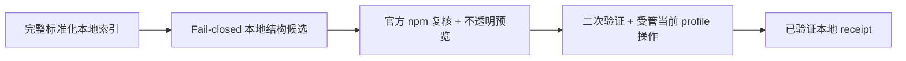

# 安装与卸载

[English](install-and-uninstall.md)

状态：已实现并用于 private Desktop 集成测试；不代表插件已经通过安全审核

本文同时说明用户会看到什么，以及开发者必须保持哪些边界。当前 Market 只会把一小类精确 npm package 安装到 DSH Desktop 的当前 profile；它不会从 GitHub 安装，不会运行目录提供的命令，也不会管理通过其他工具安装的插件。

## 四个视图

| 视图 | 展示内容 | 不代表什么 |
| --- | --- | --- |
| **发现** | 当前已选来源完整本地索引中的全部标准化条目，每次展示 50 条 | 被收录不等于允许安装、兼容性证据或推荐 |
| **可安装** | 本地 fail-closed 结构子集：要求经过审核的 provider 验证与 `repository_backlink`、精确稳定的 npm 目标和规范仓库，同时排除被阻止、已经安装或已有 receipt 的 package | 出现在这里不等于 npm 已复核、兼容性证据、代码审核或推荐 |
| **已安装** | Market 为当前 profile 保存的合法安装 receipt | 不根据当前目录猜测状态，也不展示由其他工具安装的插件 |
| **来源** | 已保存的来源记录，以及当前唯一选中的来源 | 切换来源不会切换当前 profile，也不会删除 receipt |

同一时间只浏览一个目录来源。Host 会针对该来源和 locale 完成并 cache 一份完整索引；搜索、多分类 OR 筛选、完整分类选项和每页 50 条分页都是该索引上的本地视图。切换来源会重置索引视图、搜索、分类和 cursor。**已安装**视图不同：它由 profile 和 receipt 支撑，因此即使原来源被禁用、删除或离线，仍然可以使用。

可选目录 metadata 会报告 `scannedAt`、cache `expiresAt`、可选 `providerRevision`，以及 `cacheStatus` 是 `fresh` 还是 `cached`。明确刷新会替换完整索引，并绕过目录 HTTP cache 后重新扫描，而不只是重新加载可见页面。

## 安装插件

1. 选择一个目录来源，然后打开**可安装**。
2. 选择一个条目。它出现在这里，只表示通过了 Host 本地、fail-closed 的结构候选规则；此时 Host 尚未针对该 package 请求 npm。目录给出的版本或命令始终没有执行授权。
3. Preview 此时才针对这一个候选访问官方 npm registry，检查 package/仓库身份、deprecated 状态、lifecycle script、runtime、integrity、tarball、DSH bundle 证据和当前 profile 可安装性。只有成功后，确认框才会展示目录显示名、验证过的精确 `packageName@version`、当前 profile 和过期时间。
4. 阅读“本地代码”提示并确认。确认是一次性且短时有效的；如果当前 profile 或 Host 候选发生变化，或者确认过期、已被使用，就需要重新预览。
5. Desktop 在当前 profile 中执行受管 package 操作。Host 会在真正修改 profile 前再次检查 package，随后验证安装后的 DSH bundle 并保存 receipt。
6. 重启 DSH Desktop。安装成功会修改磁盘上的 profile，但当前运行的进程不会自动加载新插件。

**可安装**只表示“这个条目是当前 profile 的本地结构候选”。它不表示已经联系 npm、兼容性已经证明，或代码已经获批、安全。Preview 仍可能拒绝它；即使 preview 成功，如果 registry、目录或 profile 状态发生变化，也不承诺执行一定成功。

## Host 接受什么

当前 MVP 只在以下检查全部通过时支持 npm package。第一项结构检查在本地完成；其余权威 package 检查在用户选择条目后的 preview 阶段执行，并在执行阶段按可变性再次检查：

- 目录给出标准化 npm package 名、精确稳定的 SemVer 版本和规范仓库身份；
- npm 返回相同的 package 名和精确版本；
- npm 的仓库身份与目录中的标准化仓库一致，存在 subdirectory 时也必须一致；
- 该版本没有 deprecated 标记；
- 目标 package manifest 没有定义 `preinstall`、`install`、`postinstall` 或 `prepare`；
- 它声明的 DSH/Cordis dependency 与基于 DSH `0.1.0-rc.7` 的 Desktop runtime 兼容，并且声明的 Node engine 接受 Desktop 内置的 Node.js runtime；
- npm 提供官方 HTTPS tarball 和合法 SHA-512 integrity；以及
- package 声明安全的 DSH bundle patch，受管操作结束后，该文件确实存在于安装 package 内且没有越出 package 目录。

生成**可安装**列表时不会逐包访问 registry；它还会排除产品阻止的 package，以及当前 profile 或 Market receipt 中已经存在的 package。Preview 针对用户选中的候选完成官方 registry 与当前 profile 复核。用户确认后、真正安装前，执行阶段会立即重复可变检查；如果 integrity、tarball、bundle 路径、目录候选或当前 profile 发生变化，就会拒绝执行。同一时间只允许一个 Market package 修改操作。

当前 MVP 会拒绝：

- GitHub URL、Git repository、release archive、commit，以及其他基于仓库的安装目标；
- 版本范围、`latest` 等 tag 和 prerelease 版本；
- provider 安装命令、shell 片段、HTML、脚本和任何可执行 adapter 数据；
- deprecated 目标，或包含上述四种 lifecycle script 之一的目标 package；
- 与当前 DSH rc.7、Cordis 或内置 Node.js runtime 不兼容的 package；
- 缺少必要 npm integrity 或 DSH bundle 证据的 package；以及
- Desktop 与 Market 产品 package 本身。

GitHub 仓库链接仍可作为不可执行的来源信息显示，也可以用于比较仓库身份；它绝不会作为安装目标传给 package manager。

## 卸载插件

1. 打开**已安装**。列表来自当前 profile 的合法 receipt，不依赖已选目录来源。
2. 点击**卸载**。Host 会确认 receipt 仍然存在，而且已安装 package、精确版本和 bundle 仍与 receipt 一致。
3. 确认精确 package 和当前 profile。UI 只提交 receipt 标识，不能自行选择任意 package 名。
4. Desktop 执行受管 remove 操作。Host 确认 package 已离开 profile 后，才移除 receipt。
5. 重启 DSH Desktop，让当前运行的进程不再使用已移除插件。

卸载不需要 provider 保持在线，也不会重新请求原目录条目。没有 Market receipt、属于其他 profile，或安装后已被修改的插件，当前 MVP 都会拒绝移除。这种保守行为可以避免 Market 错误接管由其他工具维护的 package。

## 这些检查不能证明什么

Registry 身份、integrity、仓库匹配、兼容 metadata 和 lifecycle script 策略，只能减少 Desktop “到底安装了什么”的歧义；它们不能判断插件代码或依赖树是否可信、是否保护隐私、是否正确，或是否没有漏洞。重启后，插件会以用户权限作为本地代码运行。

确认前，用户仍应检查 publisher、源码仓库、插件行为，以及自己是否信任这些代码。目录收录、**可安装**卡片、npm 复核成功和本地 receipt，都不代表 Anywhere Labs、DSH 1024Store、DeepSeek 或目录 provider 作出安全背书。

## 开发边界

安装路径包含四种彼此独立的状态：

必须保持这些状态互相分离：

- 目录 adapter 可以把远程 metadata 映射成完整标准化 snapshots，包括 `package`、`latestVersion`、repository、category 和展示字段。全量扫描分块每块最多 100 条，必须丢弃远程命令，绝不能加载远程 JavaScript。
- **可安装**的 fail-closed 结构筛选由 Host 负责。Renderer 只能展示 Host 返回的候选标识，不能根据 `latestVersion` 自行推断，也不能把其他条目提升为可安装。生成列表时不会逐包请求 npm。
- 安装 preview 只接受 `sourceRecordId` 和 `itemId`。Host 从自己此前观察到的候选中选择目标，针对该 package 完整执行官方 registry、runtime、lifecycle、integrity、仓库、DSH bundle 和当前 profile 复核，只有成功后才返回不透明 `previewId` 与精确确认摘要。
- 执行阶段只接受该 `previewId`。一次性 token 会绑定候选、registry 证据、当前 profile 和过期时间；Host 需要重新校验所有可变状态。
- 已安装状态读取只返回当前 profile 的 receipt。卸载预览只接受 `receiptId`，执行阶段同样只接受不透明 `previewId`。
- renderer 不会获得文件系统、进程、环境变量或 package manager 权限。package 修改通过 `desktopPnpm.runPlugin()` 完成，参数由 Host 固定构造，并使用当前 profile 的绝对目录。

Receipt 会记录 profile、精确 npm 身份、integrity、DSH bundle patch、目录 provenance、展示名称和安装时间。它只是“本 Market 已完成并验证一次受管安装”的本地证据，不是 provider 凭据，也不能依赖来源继续存在。

如果 Desktop package 能力不可用，目录浏览仍然可以工作，而安装与卸载会返回不可用状态。系统不会退回 ambient `pnpm`、shell、猜测的 executable、repository 命令或未激活 profile。

## 失败与恢复

| 情况 | 结果 |
| --- | --- |
| 条目不满足本地结构候选规则 | 条目留在发现页，不出现在可安装页；不请求 registry、不修改 profile，也不写入 receipt |
| Preview 阶段官方 npm 复核失败 | 不生成确认；在本地输入变化前，该结构候选仍可能可见 |
| Preview 成功后 npm 或 profile 状态发生变化 | 拒绝已确认的执行；重新生成 preview 后再试 |
| 预览过期、重复使用，或 profile/候选变化 | 拒绝操作；必须生成新的预览 |
| 受管安装失败 | 不写入 receipt；安装结果非法时会在 rollback 成功的前提下移除 |
| Receipt 无法保存 | 回滚安装；如果清理也无法完成，会要求手动移除 |
| 卸载前 receipt 或已安装 bundle 发生变化 | 拒绝卸载，不接管已变化的 package |
| 受管卸载成功但 receipt 持久化失败 | package 已移除，但 receipt store 会报告持久化错误 |

用户可见错误必须保持有界，不能暴露响应 body、本地路径、环境变量、凭据或命令。完整信任模型见[安全说明](../SECURITY.zh.md)，目录整体架构见[市场壳设计](market-shell.zh.md)。
