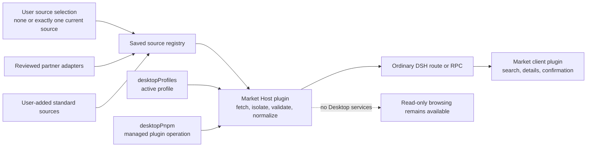

# DSH Community Market shell design

[中文](market-shell.zh.md)

Status: Host/Client market plus limited npm install and receipt-backed uninstall implemented for private integration testing

This document defines the first implementation boundary for `dsh-community-market`. It is deliberately narrower than a complete marketplace. The package owns an in-product shell and adapters; it does not own the community catalog, package registry, or DSH profile format.

## Product goals

- Give users one calm place to discover, search, and understand community plugins.
- Keep catalog browsing read-only until a user explicitly chooses an action.
- Install only into the active profile, with the plugin source and profile visible before confirmation.
- Remove only installations owned by a valid Market receipt in the active profile, even when the original source is unavailable.
- Reuse existing DSH plugin and Desktop profile behavior instead of creating parallel state.
- Let people save and add catalog sources, then explicitly browse one selected source at a time without coupling the interface to one service.
- Keep the package useful without Electron-specific access. Desktop integrations are optional capabilities, not renderer globals.

## Non-goals for the first release

- Operating a catalog backend, GitHub crawler, submission queue, or moderation system.
- User accounts, payments, reviews, rankings, advertising, or telemetry.
- Claiming that a listed plugin is safe, reviewed, compatible, or endorsed.
- Silent install, automatic install, automatic plugin update, or background profile modification.
- Executing install commands, HTML, scripts, or links supplied by a catalog response.
- Installing from GitHub or another repository target, accepting mutable versions, or running a target package that declares install lifecycle scripts.
- Editing inactive profiles or migrating plugins between profiles.

## Proposed boundary

The renderer receives normalized plain data through an ordinary DSH route or RPC. It does not receive Electron, filesystem, process, `desktopRuntime`, or package-manager access. The Host owns catalog I/O, validation, installation orchestration, cancellation, and operation serialization.

The Client contributes a `settings.plugins.tab` entry named **Plugin market** and a sidebar action that opens the same Market surface in a shell overlay. The settings entry remains the canonical management location; the sidebar is only a convenient launcher, not a second implementation or a separate workspace. Catalog requests begin only when either Market surface mounts, and both surfaces share the same Host routes and normalized data contract.

## Catalog sources and adapters

There is no default catalog. People may save several source registrations, but the browsing session has either no selection or exactly one selected source. Having no selected source produces an explicit empty state and no catalog request; it never silently falls back to a partner. Selecting another source cancels the old request and resets the visible list, search, category selection, and pagination before the new source is read.

The Host supports two source paths:

1. A user-added source implements the published HTTPS JSON contract and is handled by the standard adapter.
2. A partner with a different API is integrated through a reviewed adapter shipped with the Market code.

A remote manifest can describe data, but cannot supply adapter code, credentials, commands, enablement, or priority. Every adapter converts its private response into the same normalized page before the renderer receives it. Source-specific fields must never become UI assumptions.

The standard adapter serializes only fields declared in the source manifest's `query.supported` list. In particular, it omits `category` for a source that does not advertise category support; unsupported fields are not emulated or broadcast to that source.

[DSH 1024Store](https://github.com/imsai-sh/awesome-deepseek-harness-plugins) is one of the providers currently cooperating with the project, and the market includes a reviewed built-in adapter for its public API. It is not a default, preferred source, or fallback, and the cooperation does not mean that its listings were reviewed or endorsed. Its endpoint and schema remain owned by that independent project.

The normative draft for the implementation team is the [catalog provider contract](catalog-provider-contract.md), with machine-readable schemas for the source manifest, query, untrusted provider page, and Host-normalized response. Remote fields are display data, not executable instructions. Text is rendered as text, never as raw HTML.

## Complete local index and cache

The Host completes one full normalized scan for the selected source and current locale before serving catalog interactions. Standard sources are exhausted through their declared cursor and effective page limits. The reviewed 1024Store adapter instead performs one full-registry GET, normalizes every valid item, and emits Schema-bounded chunks of at most 100 items. The 10,000-item Host limit, source identity, cancellation, provenance, and origin checks apply across the whole scan.

Search, sorting, multi-category OR filtering, category enumeration, and pagination operate only on this complete local index. The UI shows at most 50 matching items per page. **Load more** advances a Host-owned local cursor; it does not issue another filtered provider request. The category list is the complete set present in the index. **Installable** is a fail-closed structural subset of this same index, not a second provider feed and not the result of per-package registry requests.

A completed index is cached for a bounded lifetime, currently five minutes by default. Optional response metadata may expose `scannedAt` (when the scan completed), `expiresAt` (its cache deadline), optional `providerRevision` (one revision observed consistently across all chunks), and `cacheStatus` (`fresh` for a completed scan or `cached` for a reused index). Explicit refresh invalidates the previous index and bypasses the underlying catalog HTTP cache before rebuilding it. Selecting another source cancels the old scan and starts a separate index.

## Four views and plugin actions

The Market surface has four views:

- **Discover** pages over every normalized item in the selected source's complete local index. Clicking a card opens the shared action dialog immediately; the Host either advances an eligible item into managed preview or keeps the dialog as details.
- **Installable** is derived locally and fail-closed. It requires reviewed provider verification with `repository_backlink`, an exact stable npm target, and a canonical repository, and excludes blocked packages plus packages already present in the active profile or its Market receipts. Its cards use the same dialog. Structural candidacy is not an npm verification, code review, or endorsement.
- **Installed** reads valid Market receipts for the active profile. It never infers installed state from the catalog.
- **Sources** manages saved sources and the one current selection.

Catalog browsing provides:

- a source chooser, saved source management, and addition of a conforming source;
- one selected source per browsing session, with no hidden request or fallback to another saved source;
- one complete selected-source scan, with standard-source network pages bounded by the manifest and Schema maximum of 100, and one full-registry read for the reviewed 1024Store adapter;
- a bottom **Load more** action that advances through local matching results in fixed pages of at most 50;
- loading, empty, offline, invalid-response, and retry states;
- local search over every normalized name and description in the complete index;
- multi-select category filtering with OR semantics: an item may match any selected category;
- category choices derived from every item in the complete local index;
- a details view with the source repository and catalog attribution;
- an unavailable state when installation capability is absent.

Loading the catalog never invokes a package manager, resolves a local executable, modifies a profile, or records an installation event. Catalog errors do not stop DSH or Desktop from starting.

## Installation boundary

Clicking a card is an explicit request to inspect that item. The dialog opens synchronously, while the Host checks whether the exact normalized source/item is eligible for managed preview. The Host, not the renderer, owns candidate identity and performs the first authoritative verification against the official npm registry and active profile. Only a successful preview turns that same dialog into a confirmation showing:

- plugin name;
- exact npm package name and stable version resolved by the Host;
- active profile name;
- the short-lived confirmation expiry; and
- a warning that plugins run locally with the user's permissions and that this verification is not a code audit.

Catalog `install` fields, documentation snippets, provider commands, and arbitrary strings are discarded as execution authority and are never executed. When a normalized item carries an exact stable npm identity, the Host may separately reconstruct a bounded display-only command. That text may differ from repository documentation, is explicitly marked as not fully verified, and is never sent to a package manager or Desktop action. The current managed MVP rejects GitHub and other repository install targets, ranges, tags, prereleases, deprecated versions, a target manifest containing `preinstall`, `install`, `postinstall`, or `prepare`, packages incompatible with the bundled DSH `0.1.0-rc.7`/Cordis/Node.js runtime, repository mismatches, and packages without official npm SHA-512/tarball and valid DSH bundle evidence.

Preview performs the full npm registry, canonical-repository, deprecation, lifecycle-script, runtime, integrity, tarball, DSH bundle, and active-profile checks for that one package. The resulting one-shot opaque preview binds the verified facts. Immediately before the confirmed mutation, execution re-fetches or rechecks mutable registry, candidate, and profile evidence and refuses the operation if the candidate, active profile, tarball, integrity, or bundle path changed. For managed operations the renderer submits only opaque identities, never a package-manager spec or command.

On Desktop, the Market Host uses the public services already owned by `dsh-plugin-desktop`:

1. Read the active identity from `desktopProfiles.current`.
2. Invoke `desktopPnpm.runPlugin()` with fixed `add --save-exact` arguments, the official npm registry, an explicit absolute profile directory, and an `AbortSignal`.
3. Keep stdout, stderr, environment variables, local paths, and command internals out of the renderer; the only command text it may receive is the bounded display-only instruction described above.
4. Permit one mutation at a time and reject a changed profile.
5. Verify the installed profile dependency and contained DSH bundle before saving a receipt; roll back an invalid or unrecordable install when possible.
6. After success, issue a short-lived one-shot restart grant so the user can choose **Restart now** or **Restart later**; never restart silently.

When Desktop services are unavailable, browsing stays available while package operations explain that they require DSH Desktop. Managed installation never falls back to ambient `pnpm`, a shell command, a guessed `dsh` executable, or an inactive profile. **Open DSH Terminal** is a separate user-controlled escape hatch: its request contains no command, path, or profile and only opens the terminal; the user decides whether to copy and run displayed text.

## Uninstall boundary

The **Installed** view is built only from valid local receipts scoped to the active profile. It does not depend on the selected source, so a Market-installed plugin remains removable after its source is disabled, deleted, or offline.

Uninstall preview accepts only a `receiptId`. The Host confirms that the receipt still exists and the active profile still contains the exact package version and DSH bundle recorded by that receipt. Execution accepts only the resulting one-shot opaque preview, invokes the managed `remove` operation, verifies removal, and then deletes the receipt. A package installed elsewhere, a receipt in another profile, or a package changed after installation is not removed by this MVP. After success the same **Restart now** / **Restart later** choice is shown.

## Profile behavior

- The active profile is the only installation target.
- Installed-state queries are scoped to that profile.
- The confirmation repeats the profile name so the target is never implicit.
- Switching profiles remains owned by `desktopProfiles.select()` and takes effect through the existing controlled restart.
- The market never modifies an inactive profile in the background.
- A profile switch or service disposal cancels or joins any owned operation before the plugin generation ends.

Install receipts are stored locally and include their owning profile; only receipts for the active profile are listed. They record that the Market completed and verified one managed install, not that the provider remains available or that the plugin code is safe. Sessions remain outside the market's responsibility. The market does not promise that arbitrary custom profiles share storage; it only reports and mutates receipt-owned plugin membership for the selected profile.

## Failure behavior

| Situation | User-visible result | Side effect |
| --- | --- | --- |
| Offline, timeout, non-200, oversized, or invalid catalog | Catalog unavailable with Retry | None |
| Install preview cannot verify npm metadata, or finds a deprecated, scripted, incompatible, mismatched, or incomplete package | No confirmation is issued; the structural candidate may remain visible until its local inputs change | None |
| Registry, candidate, or active profile changes after a successful preview | Host refuses the confirmed execution | None |
| Desktop package capability missing | Browsing works; Install and Uninstall are unavailable | None |
| User cancels confirmation | Return to details | None |
| Installation is cancelled or fails | Bounded error summary and Retry | No second automatic attempt |
| Installation succeeds | Restart-required message | Active profile and local receipt were reconciled by the managed service |
| Receipt or installed bundle no longer matches | Uninstall is refused | None |
| Uninstall succeeds | Restart-required message | Package and receipt were removed from the active profile |

Raw response bodies, filesystem paths, tokens, environment variables, and command strings are never included in user-facing errors or telemetry.

## Delivery phases

### Phase 0: documentation scaffold

- Own the npm name and monorepo package boundary.
- Record catalog attribution, trust rules, and integration decisions.
- Keep the package private and non-loadable.

### Phase 1: catalog market shell — implemented for integration testing

- Host and Client plugin entries.
- User-owned source selection, standard sources, reviewed partner adapters, and strict normalization.
- One-source-at-a-time complete indexing with local 50-item pagination, provenance, cache metadata, force refresh, and explicit failure handling without fallback.
- Search, categories, details, and resilient state handling.
- Headless unit tests and Loader smoke.

### Phase 2: confirmed active-profile operations — implemented for integration testing

- Desktop capability detection and unavailable state.
- Exact stable npm target verification and two-step user intent.
- Managed, serialized install with a verified receipt; reads and previews are cancellable, while an accepted mutation is Host-owned.
- Receipt-backed uninstall independent of the catalog source.
- Restart guidance after a successful profile change.

### Later work

- Updates, richer recovery, and release hardening.
- Stronger verification signals based on independently specified evidence.

## Attribution and independence

The design is informed by community catalog projects including [imsai-sh/awesome-deepseek-harness-plugins](https://github.com/imsai-sh/awesome-deepseek-harness-plugins), also presented as DSH 1024Store. DSH 1024Store is a current cooperating provider, and it also publishes the separate `dsh-1024store` plugin. DSH Community Market is not a fork, repackaging, or official client of that plugin. Its application code is MIT licensed and its catalog metadata is CC0-1.0. This scaffold copies neither its code nor its artwork and bundles no catalog snapshot.

DSH Community Market is an independent Anywhere Labs project. Catalog inclusion does not imply endorsement by Anywhere Labs, DSH 1024Store, DeepSeek, or a plugin author.
