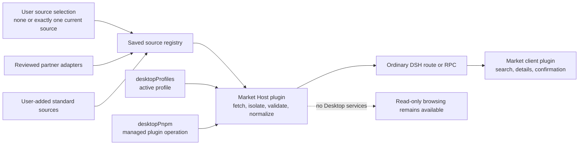

# DSH Community Market shell design

[中文](market-shell.zh.md)

Status: proposed; read-only Host/Client market MVP implemented for integration testing, installer not implemented

This document defines the first implementation boundary for `dsh-community-market`. It is deliberately narrower than a complete marketplace. The package owns an in-product shell and adapters; it does not own the community catalog, package registry, or DSH profile format.

## Product goals

- Give users one calm place to discover, search, and understand community plugins.
- Keep catalog browsing read-only until a user explicitly chooses an action.
- Install only into the active profile, with the plugin source and profile visible before confirmation.
- Reuse existing DSH plugin and Desktop profile behavior instead of creating parallel state.
- Let people save and add catalog sources, then explicitly browse one selected source at a time without coupling the interface to one service.
- Keep the package useful without Electron-specific access. Desktop integrations are optional capabilities, not renderer globals.

## Non-goals for the first release

- Operating a catalog backend, GitHub crawler, submission queue, or moderation system.
- User accounts, payments, reviews, rankings, advertising, or telemetry.
- Claiming that a listed plugin is safe, reviewed, compatible, or endorsed.
- Silent install, automatic install, automatic plugin update, or background profile modification.
- Executing install commands, HTML, scripts, or links supplied by a catalog response.
- Editing inactive profiles or migrating plugins between profiles.

## Proposed boundary

The renderer receives normalized plain data through an ordinary DSH route or RPC. It does not receive Electron, filesystem, process, `desktopRuntime`, or package-manager access. The Host owns catalog I/O, validation, installation orchestration, cancellation, and operation serialization.

The Client contributes a `settings.plugins.tab` entry named **Plugin market** and a sidebar action that opens the same Market surface in a shell overlay. The settings entry remains the canonical management location; the sidebar is only a convenient launcher, not a second implementation or a separate workspace. Catalog requests begin only when either Market surface mounts, and both surfaces share the same Host routes and normalized data contract.

## Catalog sources and adapters

There is no default catalog. People may save several source registrations, but the browsing session has either no selection or exactly one selected source. Having no selected source produces an explicit empty state and no catalog request; it never silently falls back to a partner. Selecting another source cancels the old request and resets the visible list, search, category selection, and pagination before the new source is read.

The Host supports two source paths:

1. A user-added source implements the published HTTPS JSON contract and is handled by the standard adapter.
2. A partner with a different API is integrated through a reviewed adapter shipped with the Market code.

A remote manifest can describe data, but cannot supply adapter code, credentials, commands, enablement, or priority. Every adapter converts its private response into the same normalized page before the renderer receives it. Source-specific fields must never become UI assumptions.

The standard adapter serializes only fields declared in the source manifest's `query.supported` list. In particular, it omits `category` for a source that does not advertise category support; unsupported fields are not emulated or broadcast to that source.

[DSH 1024Store](https://github.com/imsai-sh/awesome-deepseek-harness-plugins) is one of the providers currently cooperating with the project, and the market includes a reviewed built-in adapter for its public API. It is not a default, preferred source, or fallback, and the cooperation does not mean that its listings were reviewed or endorsed. Its endpoint and schema remain owned by that independent project.

The normative draft for the implementation team is the [catalog provider contract](catalog-provider-contract.md), with machine-readable schemas for the source manifest, query, untrusted provider page, and Host-normalized response. Remote fields are display data, not executable instructions. Text is rendered as text, never as raw HTML.

## Read-only browsing

Phase 1 provides:

- a source chooser, saved source management, and addition of a conforming source;
- one selected source per browsing session, with no hidden request or fallback to another saved source;
- standard-source requests that default to 50 items when `limit` is supported, while respecting the manifest's effective `maxLimit` or, when `limit` is unsupported, its `defaultLimit` (both bounded by the Schema maximum of 100);
- a bottom **Load more** action that follows the selected standard source's cursor under the same declared paging rules; the reviewed 1024Store adapter instead exposes fixed local pages of 50;
- loading, empty, offline, invalid-response, and retry states;
- search over normalized names and descriptions;
- multi-select category filtering with OR semantics: an item may match any selected category;
- category choices accumulated from currently loaded items in the selected-source session, not a provider-wide or guaranteed-complete facet list;
- a details view with the source repository and catalog attribution;
- an unavailable state when installation capability is absent.

Loading the catalog never invokes a package manager, resolves a local executable, modifies a profile, or records an installation event. Catalog errors do not stop DSH or Desktop from starting.

## Installation boundary

Installation belongs to Phase 2 and starts only from a user gesture. Before execution, the confirmation must show:

- plugin name;
- canonical package or source repository identity;
- exact pinned package version or immutable repository commit;
- active profile name;
- a warning that plugins run locally with the user's permissions;
- a warning that package lifecycle scripts may run during installation.

Catalog `install` fields, documentation snippets, and arbitrary command strings are never executed. The Host independently resolves a validated package identity to an exact SemVer version, or a canonical repository identity to an immutable commit. Mutable, unresolved, or changed targets keep installation disabled. Resolution, revalidation, and quoting rules must be covered by tests before installation is enabled.

On Desktop, the Market Host will use the public services already owned by `dsh-plugin-desktop`:

1. Read the active identity from `desktopProfiles.current`.
2. Invoke `desktopPnpm.runPlugin()` with an `add` operation, an explicit absolute invoking directory, and an `AbortSignal`.
3. Stream bounded progress to the UI without exposing environment variables or command internals.
4. Permit one mutation at a time.
5. Treat non-zero exit, signal, cancellation, service disposal, and profile restart as distinct outcomes.
6. On success, tell the user that Desktop must restart before the new plugin is loaded.

When Desktop services are unavailable, the first implementation stays read-only and explains why installation is disabled. It must not fall back to ambient `pnpm`, a shell command, or a guessed `dsh` executable. A future ordinary-DSH installer requires a supported Host capability with equivalent profile and cancellation semantics.

## Profile behavior

- The active profile is the only installation target.
- Installed-state queries are scoped to that profile.
- The confirmation repeats the profile name so the target is never implicit.
- Switching profiles remains owned by `desktopProfiles.select()` and takes effect through the existing controlled restart.
- The market never modifies an inactive profile in the background.
- A profile switch or service disposal cancels or joins any owned operation before the plugin generation ends.

Sessions and records are outside the market's responsibility. The market does not promise that arbitrary custom profiles share storage; it only reports and mutates plugin membership for the selected profile.

## Failure behavior

| Situation | User-visible result | Side effect |
| --- | --- | --- |
| Offline, timeout, non-200, oversized, or invalid catalog | Catalog unavailable with Retry | None |
| Unknown or unsafe repository identity | Installation disabled with reason | None |
| Desktop install capability missing | Browsing works; Install is unavailable | None |
| User cancels confirmation | Return to details | None |
| Installation is cancelled or fails | Bounded error summary and Retry | No second automatic attempt |
| Installation succeeds | Restart-required message | Active profile was reconciled by the managed service |

Raw response bodies, filesystem paths, tokens, environment variables, and command strings are never included in user-facing errors or telemetry.

## Delivery phases

### Phase 0: documentation scaffold

- Own the npm name and monorepo package boundary.
- Record catalog attribution, trust rules, and integration decisions.
- Keep the package private and non-loadable.

### Phase 1: read-only market shell

- Host and Client plugin entries.
- User-owned source selection, standard sources, reviewed partner adapters, and strict normalization.
- One-source-at-a-time browsing with source-scoped pagination, provenance, and explicit failure handling without fallback.
- Search, categories, details, and resilient state handling.
- Headless unit tests and Loader smoke; no installer.

### Phase 2: confirmed active-profile install

- Optional Desktop capability detection.
- Exact target derivation and two-step user intent.
- Managed, cancellable, serialized operation and restart guidance.

### Later work

- Installed-state detail, uninstall, update, and recovery.
- Stronger verification signals based on independently specified evidence.

## Attribution and independence

The design is informed by community catalog projects including [imsai-sh/awesome-deepseek-harness-plugins](https://github.com/imsai-sh/awesome-deepseek-harness-plugins), also presented as DSH 1024Store. DSH 1024Store is a current cooperating provider, and it also publishes the separate `dsh-1024store` plugin. DSH Community Market is not a fork, repackaging, or official client of that plugin. Its application code is MIT licensed and its catalog metadata is CC0-1.0. This scaffold copies neither its code nor its artwork and bundles no catalog snapshot.

DSH Community Market is an independent Anywhere Labs project. Catalog inclusion does not imply endorsement by Anywhere Labs, DSH 1024Store, DeepSeek, or a plugin author.
