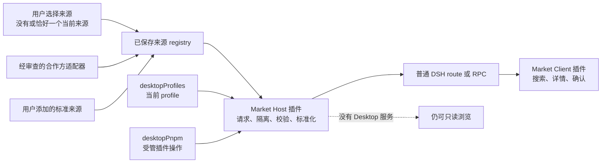

# DSH Community Market 市场壳设计

[English](market-shell.md)

状态：设计提案；只读 Host/Client 市场 MVP 已实现并进入集成测试，安装器尚未实现

本文定义 `dsh-community-market` 第一阶段的实现边界。它刻意比完整的插件市场更小：package 只负责产品内的市场壳和适配器，不负责社区目录、包 registry 或 DSH profile 格式。

## 产品目标

- 给用户一个安静、清晰的入口，用来发现、搜索和了解社区插件。
- 在用户明确选择操作前，目录浏览始终保持只读。
- 只安装到当前 profile，并在确认前展示插件来源和目标 profile。
- 复用现有 DSH 插件与 Desktop profile 行为，不创建平行状态。
- 让用户保存和添加目录来源，再明确选择同一时间只浏览其中一个，避免界面永久绑定某一个服务。
- 不依赖 Electron 私有访问也能工作；Desktop 集成是可选能力，不是 renderer 全局对象。

## 第一版不做什么

- 运营目录后台、GitHub 爬虫、投稿队列或审核系统。
- 账号、付费、评论、排行榜、广告或遥测。
- 宣称被收录插件安全、经过审核、兼容或得到推荐。
- 静默安装、自动安装、插件自动更新或后台修改 profile。
- 执行目录响应中的安装命令、HTML、脚本或链接。
- 修改未激活 profile，或在 profile 之间迁移插件。

## 规划边界

renderer 只通过普通 DSH route 或 RPC 接收标准化纯数据，不会获得 Electron、文件系统、进程、`desktopRuntime` 或包管理器访问。Host 负责目录 I/O、校验、安装编排、取消和操作串行化。

Client 会贡献一个名为**插件市场**的 `settings.plugins.tab`，同时提供一个侧边栏按钮，用 shell overlay 打开同一套 Market 界面。设置页仍然是规范的管理入口；侧边栏只是便捷入口，不是第二份实现，也不是独立 workspace。只有任一 Market 界面真正挂载后才会开始目录请求，两处界面共用相同的 Host routes 与标准化数据合同。

## 目录来源与适配器

市场不设默认目录。用户可以保存多个来源记录，但浏览会话只能没有选择，或恰好选择一个来源。没有选择来源时要展示明确的空状态且不发出目录请求，不能悄悄退回到某个合作方。选择另一个来源时，必须先取消旧请求并重置当前列表、搜索、分类选择和分页，再读取新来源。

Host 支持两条来源路径：

1. 用户添加的来源实现公开 HTTPS JSON 合同，由标准适配器处理。
2. 接口不同的合作方，通过随 Market 代码发布且经过审查的适配器接入。

远程 manifest 可以描述数据，但不能提供适配器代码、凭据、命令、启用状态或优先级。每个适配器都必须先把私有响应转成同一套标准化页面，才能交给 renderer；来源私有字段不能变成 UI 假设。

标准 adapter 只序列化来源 manifest 的 `query.supported` 清单中声明的字段。尤其是，来源没有声明支持 `category` 时，adapter 会针对该来源省略该字段，而不是模拟该能力或把筛选广播给该来源。

[DSH 1024Store](https://github.com/imsai-sh/awesome-deepseek-harness-plugins) 是目前与项目合作的提供方之一，市场已包含针对其公开 API、经过审查的内置适配器。它不是默认、优先或兜底来源，合作关系也不表示其收录内容经过我们审核或推荐。它的接口和 schema 继续归该独立项目所有。

面向实现团队的规范是[目录提供方合同](catalog-provider-contract.zh.md)，其中包含来源 manifest、query、不可信 provider page 和 Host 标准化响应的机器可读 Schema。远程字段只是展示数据，不是可执行指令；文本只能按文本渲染，不能作为原始 HTML。

## 只读浏览

Phase 1 提供：

- 来源选择、已保存来源管理和添加符合规范的来源；
- 每个浏览会话只有一个已选来源，不暗中请求或退回其他已保存来源；
- 标准来源声明支持 `limit` 时默认请求 50 个条目，同时服从 manifest 的有效 `maxLimit`；不支持 `limit` 时尊重 `defaultLimit`，两者都受 Schema 最大值 100 约束；
- 页面底部的**加载更多**按照同一已选标准来源的 cursor 和声明分页规则继续；经过审核的 1024Store adapter 则固定按 50 条在本地分页；
- 加载、空目录、离线、非法响应和重试状态；
- 基于标准化名称与描述的搜索；
- 采用 OR 语义的多选分类筛选：条目匹配任一已选分类即可；
- 分类选项从当前单来源会话已加载的条目中累计产生，不是 provider 全量或保证完整的 facet 清单；
- 包含源码仓库和目录来源的详情页；
- 缺少安装能力时的不可用说明。

加载目录时不会调用包管理器、解析本地 executable、修改 profile 或记录安装事件。目录错误也不会阻止 DSH 或 Desktop 启动。

## 安装边界

安装属于 Phase 2，并且只能由用户操作开始。执行前的确认必须展示：

- 插件名称；
- 规范化 package 或源码仓库身份；
- 已锁定的精确 package 版本或不可变 repository commit；
- 当前 profile 名称；
- 插件会以用户权限在本地运行的提示；
- 安装时可能执行 package lifecycle script 的提示。

目录中的 `install` 字段、文档命令或任意命令字符串都不会被执行。Host 会独立把经过校验的 package identity 解析为精确 SemVer 版本，或把规范仓库身份解析为不可变 commit。目标可变、未解析或重新校验时发生变化，安装都保持禁用。启用安装前，解析、重新校验和引用规则必须由测试锁定。

在 Desktop 中，Market Host 会使用 `dsh-plugin-desktop` 已提供的公开服务：

1. 从 `desktopProfiles.current` 读取当前身份。
2. 调用 `desktopPnpm.runPlugin()`，传入 `add` 操作、明确的绝对 invoking directory 和 `AbortSignal`。
3. 向界面输出有界进度，但不暴露环境变量或命令内部细节。
4. 同一时间只允许一个修改操作。
5. 区分非零退出、signal、取消、服务释放和 profile 重启。
6. 成功后明确提示用户：重启 Desktop 后新插件才会加载。

没有 Desktop 服务时，第一版仍可只读浏览，并说明为什么不能安装。它不会退回 ambient `pnpm`、shell 命令或猜测的 `dsh` executable。未来若支持普通 DSH 安装，必须先有同等 profile 与取消语义的正式 Host 能力。

## Profile 行为

- 当前 profile 是唯一安装目标。
- 已安装状态查询也按当前 profile 隔离。
- 确认框再次显示 profile 名称，目标不能隐含。
- 切换 profile 继续由 `desktopProfiles.select()` 管理，并通过已有的受控重启生效。
- 市场不会在后台修改未激活 profile。
- profile 切换或服务释放时，必须先取消或等待自己拥有的操作，再结束插件 generation。

会话和记录不属于市场职责。市场不会承诺任意自定义 profile 共享存储，只负责报告和修改选中 profile 的插件成员。

## 失败处理

| 情况 | 用户看到什么 | 副作用 |
| --- | --- | --- |
| 离线、超时、非 200、响应过大或格式非法 | 目录暂不可用，并提供重试 | 无 |
| 未知或不安全的仓库身份 | 禁用安装并说明原因 | 无 |
| 缺少 Desktop 安装能力 | 可以浏览，但安装不可用 | 无 |
| 用户取消确认 | 返回详情页 | 无 |
| 安装取消或失败 | 有界错误摘要和重试入口 | 不自动进行第二次尝试 |
| 安装成功 | 提示需要重启 | 当前 profile 已由受管服务完成 reconcile |

面向用户的错误或遥测中，不得包含原始响应 body、文件路径、token、环境变量或命令字符串。

## 交付阶段

### Phase 0：文档初始化工程

- 确认 npm 名称和 monorepo package 边界。
- 记录目录来源、信任规则和集成决策。
- package 保持私有且不可加载。

### Phase 1：只读市场壳

- Host 与 Client 插件入口。
- 用户拥有的来源选择、标准来源、经审查的合作方适配器与严格标准化。
- 一次一个来源的浏览、按来源分页、provenance，以及不做兜底的明确失败处理。
- 搜索、分类、详情和完整状态处理。
- headless 单元测试与 Loader smoke；不包含安装器。

### Phase 2：确认后安装到当前 profile

- 可选 Desktop 能力检测。
- 精确目标推导和两步用户意图。
- 受管、可取消、串行化的操作与重启说明。

### 后续工作

- 已安装状态详情、卸载、更新与失败恢复。
- 基于独立规范证据的更强验证信号。

## 来源与独立性

本设计参考了多个社区目录项目，其中包括 [imsai-sh/awesome-deepseek-harness-plugins](https://github.com/imsai-sh/awesome-deepseek-harness-plugins)，该项目也以 DSH 1024Store 展示。DSH 1024Store 是当前合作的提供方，并另行发布 `dsh-1024store` 插件。DSH Community Market 不是该插件的 fork、重新打包版本或官方客户端。其应用代码使用 MIT，目录元数据使用 CC0-1.0。当前初始化工程没有复制其代码或素材，也没有打包目录快照。

DSH Community Market 是 Anywhere Labs 的独立项目。目录收录不表示 Anywhere Labs、DSH 1024Store、DeepSeek 或插件作者对项目作出推荐。
