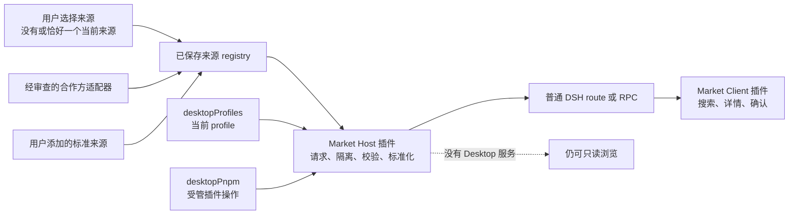

# DSH Community Market 市场壳设计

[English](market-shell.md)

状态：Host/Client 市场与有限 npm 安装、基于 receipt 的卸载已实现，正在进行 private 集成测试

本文定义 `dsh-community-market` 第一阶段的实现边界。它刻意比完整的插件市场更小：package 只负责产品内的市场壳和适配器，不负责社区目录、包 registry 或 DSH profile 格式。

## 产品目标

- 给用户一个安静、清晰的入口，用来发现、搜索和了解社区插件。
- 在用户明确选择操作前，目录浏览始终保持只读。
- 只安装到当前 profile，并在确认前展示插件来源和目标 profile。
- 只移除当前 profile 中拥有合法 Market receipt 的安装，即使原来源已经不可用也能卸载。
- 复用现有 DSH 插件与 Desktop profile 行为，不创建平行状态。
- 让用户保存和添加目录来源，再明确选择同一时间只浏览其中一个，避免界面永久绑定某一个服务。
- 不依赖 Electron 私有访问也能工作；Desktop 集成是可选能力，不是 renderer 全局对象。

## 第一版不做什么

- 运营目录后台、GitHub 爬虫、投稿队列或审核系统。
- 账号、付费、评论、排行榜、广告或遥测。
- 宣称被收录插件安全、经过审核、兼容或得到推荐。
- 静默安装、自动安装、插件自动更新或后台修改 profile。
- 执行目录响应中的安装命令、HTML、脚本或链接。
- 从 GitHub 或其他仓库目标安装、接受可变版本，或运行声明了安装 lifecycle script 的目标 package。
- 修改未激活 profile，或在 profile 之间迁移插件。

## 规划边界

renderer 只通过普通 DSH route 或 RPC 接收标准化纯数据，不会获得 Electron、文件系统、进程、`desktopRuntime` 或包管理器访问。Host 负责目录 I/O、校验、安装编排、取消和操作串行化。

Client 会贡献一个名为**插件市场**的 `settings.plugins.tab`，同时提供一个侧边栏按钮，用 shell overlay 打开同一套 Market 界面。设置页仍然是规范的管理入口；侧边栏只是便捷入口，不是第二份实现，也不是独立 workspace。只有任一 Market 界面真正挂载后才会开始目录请求，两处界面共用相同的 Host routes 与标准化数据合同。

## 目录来源与适配器

市场不设默认目录。用户可以保存多个来源记录，但浏览会话只能没有选择，或恰好选择一个来源。没有选择来源时要展示明确的空状态且不发出目录请求，不能悄悄退回到某个合作方。选择另一个来源时，必须先取消旧请求并重置当前列表、搜索、分类选择和分页，再读取新来源。

Host 支持两条来源路径：

1. 用户添加的来源实现公开 HTTPS JSON 合同，由标准适配器处理。
2. 接口不同的合作方，通过随 Market 代码发布且经过审查的适配器接入。

远程 manifest 可以描述数据，但不能提供适配器代码、凭据、命令、启用状态或优先级。每个适配器都必须先把私有响应转成同一套标准化页面，才能交给 renderer；来源私有字段不能变成 UI 假设。

标准 adapter 只序列化来源 manifest 的 `query.supported` 清单中声明的字段。尤其是，来源没有声明支持 `category` 时，adapter 会针对该来源省略该字段，而不是模拟该能力或把筛选广播给该来源。

[DSH 1024Store](https://github.com/imsai-sh/awesome-deepseek-harness-plugins) 是目前与项目合作的提供方之一，市场已包含针对其公开 API、经过审查的内置适配器。它不是默认、优先或兜底来源，合作关系也不表示其收录内容经过我们审核或推荐。它的接口和 schema 继续归该独立项目所有。

面向实现团队的规范是[目录提供方合同](catalog-provider-contract.zh.md)，其中包含来源 manifest、query、不可信 provider page 和 Host 标准化响应的机器可读 Schema。远程字段只是展示数据，不是可执行指令；文本只能按文本渲染，不能作为原始 HTML。

## 完整本地索引与 cache

Host 会先针对已选来源和当前 locale 完成一次全量标准化扫描，再提供目录交互。标准来源按照声明的 cursor 和有效 page limit 扫描到结束；经过审核的 1024Store adapter 则只执行一次完整 registry GET，标准化每个合法条目，并按每块最多 100 条的 Schema 上限输出。10,000 条 Host 上限、来源身份、取消、provenance 和同源检查覆盖整次扫描。

搜索、排序、多分类 OR 筛选、分类枚举和分页只在这份完整本地索引上运行。UI 每页最多展示 50 条匹配结果；**加载更多**推进 Host 拥有的本地 cursor，不会再次向 provider 发出带筛选的请求。分类列表是索引中存在的完整分类集合。**可安装**是同一索引上 fail-closed 的结构子集，不是第二个 provider feed，也不是逐包请求 registry 得出的结果。

完成的索引会在有界时间内复用，当前默认五分钟。可选 response metadata 可以提供：`scannedAt`（扫描完成时间）、`expiresAt`（cache 截止时间）、可选 `providerRevision`（所有分块中一致观察到的 revision），以及 `cacheStatus`（完成新扫描时为 `fresh`，复用索引时为 `cached`）。明确刷新会使旧索引失效，并绕过底层目录 HTTP cache 后重新建立。选择另一个来源会取消旧扫描并建立独立索引。

## 四个视图与只读发现

Market 界面包含四个视图：

- **发现**对当前已选来源完整本地索引中的全部标准化条目进行分页，详情和仓库链接保持只读。
- **可安装**在本地以 fail-closed 方式生成。条目必须具有经过审核的 provider 验证与 `repository_backlink`、精确稳定的 npm 目标和规范仓库，同时排除被阻止的 package，以及当前 profile 或 Market receipt 中已经存在的 package。这种结构候选身份不等于 npm 复核、代码审核或推荐。
- **已安装**读取当前 profile 的合法 Market receipt，绝不会根据目录猜测安装状态。
- **来源**管理已保存来源和唯一的当前选择。

目录浏览提供：

- 来源选择、已保存来源管理和添加符合规范的来源；
- 每个浏览会话只有一个已选来源，不暗中请求或退回其他已保存来源；
- 对唯一已选来源执行一次完整扫描；标准来源的网络 page 服从 manifest 和 Schema 最大值 100，经过审核的 1024Store adapter 只读取一次完整 registry；
- 页面底部的**加载更多**按每页最多 50 条推进本地匹配结果；
- 加载、空目录、离线、非法响应和重试状态；
- 在完整索引的全部标准化名称与描述上进行本地搜索；
- 采用 OR 语义的多选分类筛选：条目匹配任一已选分类即可；
- 分类选项来自完整本地索引中的全部条目；
- 包含源码仓库和目录来源的详情页；
- 缺少安装能力时的不可用说明。

加载目录时不会调用包管理器、解析本地 executable、修改 profile 或记录安装事件。目录错误也不会阻止 DSH 或 Desktop 启动。

## 安装边界

安装只能由用户在**可安装**视图中明确操作后开始。由 Host 而不是 renderer 使用 fail-closed 本地规则，从完整标准化索引中推导结构候选集合。Renderer 只接收 Host 返回的候选标识，不能把其他**发现**条目自行提升为可安装。点击某个候选后，Host 才会首次针对该 package 访问官方 npm registry，并结合当前 profile 做权威复核。只有 preview 成功后，确认框才会展示：

- 插件名称；
- Host 解析出的精确 npm package 名与稳定版本；
- 当前 profile 名称；
- 短时确认的过期时间；以及
- 插件会以用户权限作为本地代码运行、而且该复核不等于代码审计的提示。

目录中的 `install` 字段、文档命令、provider 命令和任意字符串都不会被执行。当前 MVP 只接受精确、稳定的 npm package。GitHub 与其他仓库安装目标、range、tag、prerelease、deprecated 版本、目标 manifest 中包含 `preinstall`、`install`、`postinstall` 或 `prepare` 的 package、与内置 DSH `0.1.0-rc.7`/Cordis/Node.js runtime 不兼容的 package、仓库身份不匹配的 package，以及缺少官方 npm SHA-512/tarball 或有效 DSH bundle 证据的 package，都会被拒绝。

Preview 会针对这一个 package 完整检查 npm registry、规范仓库、deprecated 状态、lifecycle script、runtime、integrity、tarball、DSH bundle 和当前 profile，并用一次性不透明 preview 绑定已验证事实。用户确认后、真正修改前，执行阶段会立即重新获取或检查可变的 registry、候选和 profile 证据；候选、当前 profile、tarball、integrity 或 bundle 路径发生变化时会拒绝执行。Renderer 绝不会提交 package-manager spec 或命令。

在 Desktop 中，Market Host 使用 `dsh-plugin-desktop` 已提供的公开服务：

1. 从 `desktopProfiles.current` 读取当前身份。
2. 调用 `desktopPnpm.runPlugin()`，使用固定构造的 `add --save-exact` 参数、官方 npm registry、明确的绝对 profile 目录和 `AbortSignal`。
3. 不把 stdout、stderr、环境变量、本地路径或命令内部细节交给 renderer。
4. 同一时间只允许一个修改操作，并拒绝已变化的 profile。
5. 保存 receipt 前验证 profile dependency 和没有越出 package 的 DSH bundle；安装结果非法或无法记录时，会在可行范围内回滚。
6. 成功后明确提示用户：重启 Desktop 后新插件才会加载。

没有 Desktop 服务时，目录浏览仍可使用，package 操作则会说明需要 DSH Desktop。Market 不会退回 ambient `pnpm`、shell 命令、猜测的 `dsh` executable 或未激活 profile。

## 卸载边界

**已安装**视图只来自当前 profile 的合法本地 receipt，不依赖已选来源。因此，即使安装来源后来被禁用、删除或离线，通过 Market 安装的插件仍然可以卸载。

卸载预览只接受 `receiptId`。Host 会确认 receipt 仍然存在，并且当前 profile 仍包含 receipt 记录的精确 package 版本和 DSH bundle。执行阶段只接受由此生成的不透明一次性 preview，调用受管 `remove` 操作，确认 package 已移除后再删除 receipt。通过其他方式安装的 package、其他 profile 的 receipt，或安装后已经发生变化的 package，当前 MVP 都不会移除。profile 修改完成后，UI 会提示重启。

## Profile 行为

- 当前 profile 是唯一安装目标。
- 已安装状态查询也按当前 profile 隔离。
- 确认框再次显示 profile 名称，目标不能隐含。
- 切换 profile 继续由 `desktopProfiles.select()` 管理，并通过已有的受控重启生效。
- 市场不会在后台修改未激活 profile。
- profile 切换或服务释放时，必须先取消或等待自己拥有的操作，再结束插件 generation。

安装 receipt 保存在本地并记录所属 profile；界面只列出当前 profile 的 receipt。它只说明 Market 完成并验证过一次受管安装，不表示 provider 仍然可用，也不表示插件代码安全。会话不属于市场职责。市场不会承诺任意自定义 profile 共享存储，只负责报告和修改当前 profile 中由 receipt 持有的插件成员。

## 失败处理

| 情况 | 用户看到什么 | 副作用 |
| --- | --- | --- |
| 离线、超时、非 200、响应过大或格式非法 | 目录暂不可用，并提供重试 | 无 |
| 安装 preview 无法验证 npm metadata，或发现 package deprecated、带安装脚本、不兼容、身份不匹配或缺少证据 | 不生成确认；在本地输入变化前，该结构候选仍可能可见 | 无 |
| Preview 成功后 registry、候选或当前 profile 发生变化 | Host 拒绝已经确认的执行 | 无 |
| 缺少 Desktop package 能力 | 可以浏览，但安装和卸载不可用 | 无 |
| 用户取消确认 | 返回详情页 | 无 |
| 安装取消或失败 | 有界错误摘要和重试入口 | 不自动进行第二次尝试 |
| 安装成功 | 提示需要重启 | 当前 profile 与本地 receipt 已由受管服务完成 reconcile |
| Receipt 或已安装 bundle 不再匹配 | 拒绝卸载 | 无 |
| 卸载成功 | 提示需要重启 | 已从当前 profile 移除 package 与 receipt |

面向用户的错误或遥测中，不得包含原始响应 body、文件路径、token、环境变量或命令字符串。

## 交付阶段

### Phase 0：文档初始化工程

- 确认 npm 名称和 monorepo package 边界。
- 记录目录来源、信任规则和集成决策。
- package 保持私有且不可加载。

### Phase 1：目录市场壳——已实现并进入集成测试

- Host 与 Client 插件入口。
- 用户拥有的来源选择、标准来源、经审查的合作方适配器与严格标准化。
- 一次一个来源的完整索引、本地 50 条分页、provenance、cache metadata、强制刷新，以及不做兜底的明确失败处理。
- 搜索、分类、详情和完整状态处理。
- headless 单元测试与 Loader smoke。

### Phase 2：确认后的当前 profile 操作——已实现并进入集成测试

- Desktop 能力检测和不可用状态。
- 精确稳定 npm 目标复核和两步用户意图。
- 受管、串行化且带验证 receipt 的安装；读取和预览可取消，已接受的 mutation 则由 Host 持有。
- 不依赖目录来源、基于 receipt 的卸载。
- profile 修改成功后的重启说明。

### 后续工作

- 更新、更丰富的失败恢复和发布加固。
- 基于独立规范证据的更强验证信号。

## 来源与独立性

本设计参考了多个社区目录项目，其中包括 [imsai-sh/awesome-deepseek-harness-plugins](https://github.com/imsai-sh/awesome-deepseek-harness-plugins)，该项目也以 DSH 1024Store 展示。DSH 1024Store 是当前合作的提供方，并另行发布 `dsh-1024store` 插件。DSH Community Market 不是该插件的 fork、重新打包版本或官方客户端。其应用代码使用 MIT，目录元数据使用 CC0-1.0。当前初始化工程没有复制其代码或素材，也没有打包目录快照。

DSH Community Market 是 Anywhere Labs 的独立项目。目录收录不表示 Anywhere Labs、DSH 1024Store、DeepSeek 或插件作者对项目作出推荐。
