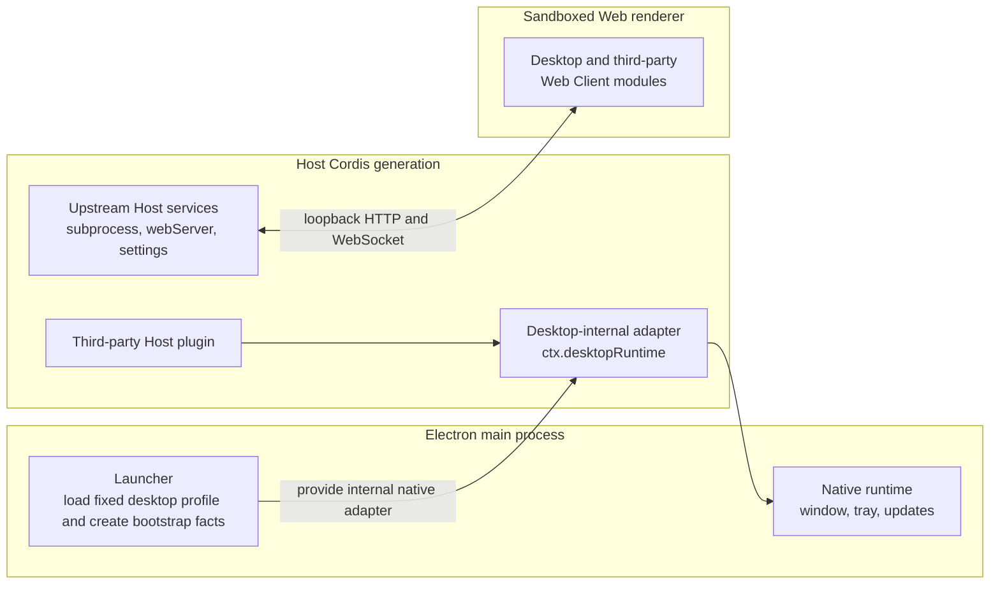

# PicoAide Harness plugin services

English | [中文](plugin-services.zh.md)

This document is the supported Host-side integration contract for plugin authors. PicoAide Harness 2.x runs the fixed `desktop` profile with the advanced platform-native presentation. It does not grant third-party access to raw Electron APIs, the renderer, or launcher bootstrap state.

## Layers and data flow



The launcher loads one fixed profile before the Loader tree mounts. There is no profile selector in the tray and no mode switch. Service references must not cross a Cordis generation boundary.

The renderer receives ordinary Web Client modules over the existing loopback carrier. It cannot read these Host services directly, and PicoAide Harness adds no preload or Electron IPC bridge for them. A plugin with browser UI continues to use normal DSH Host routes, RPC, client metadata, services, and slots.

## Internal capabilities

| Name | Boundary | Plugin-author status |
| --- | --- | --- |
| `desktopRuntime` | Launcher-provided native adapter used by Desktop-owned shell, diagnostics, and update rows. | Desktop-internal. Third-party plugins must not inject it or rely on its window/tray methods. |
| `desktopActions` | Generation-scoped Host service exposing only the restart operation. | Public through `dsh-plugin-desktop` root entry; keep usage to explicit user actions. |

The native tray supports effect-scoped contributions from Host plugins through `desktopRuntime.registerTrayItem`. A third-party plugin may contribute a `tools` item with a stable label and invocation; the tray menu is rebuilt automatically when the item's observable state changes.

## Injection patterns

### Desktop-only plugin: tray contribution

A plugin that only makes sense inside PicoAide Harness can contribute a native tray command. Cordis keeps the plugin pending until `desktopRuntime` is available and unloads its effects if the provider disappears.

```ts
import type { Context } from '@deepseek-ai/cordis'
import type {} from 'dsh-plugin-desktop'

export const name = 'example-desktop-plugin'
export const inject = ['desktopRuntime']

export function apply(ctx: Context): void {
  ctx.effect(() => {
    const registration = ctx.desktopRuntime.registerTrayItem({
      group: 'tools',
      order: 30,
      label: () => 'Example Action',
      invoke: () => { /* explicit user action */ },
    })
    return () => { registration.dispose() }
  }, 'dsh-plugin-desktop: example tray command')
}
```

`registerTrayItem` returns a refreshable registration handle. Do not retain it beyond the owning effect's lifetime.

## Failure and teardown checklist

1. Keep all tray contributions inside a Cordis `effect` so disposal removes them.
2. Never read `ctx.desktopRuntime` outside the generation that provided it.
3. Avoid assuming a specific tray label set; Desktop-owned labels may change.
4. Handle async invocation failures inside `invoke()`; the tray adapter logs them.

## Current dshmarket boundary

`dshmarket@1.2.3` predates this contract. It chooses `config.profile`, then launcher argv, then `web`; it privately imports `node:child_process`, discovers a bare `dsh` command, and runs `dsh plugin --profile ...` itself. Its public package exports expose no route or runner injection seam. An external config patch can correct the profile name and a PATH shim can make its legacy command discoverable.

PicoAide Harness therefore does not preinstall or depend on that version. A compatible future release must keep its config/argv/CLI path when Desktop services are absent under ordinary DSH and avoid treating Desktop services as required top-level injections for the cross-environment package.

There is a separate redistribution gate. The `1.2.3` manifest and README say MIT, but its source repository and npm tarball contain no complete MIT license text or copyright notice. Until a newly audited release includes the required notice, user-directed installation remains distinct from Desktop embedding the package in its application archive or installer.

## Stability boundary

The supported plugin-author surface is the `desktopRuntime` registration contract and the `desktopActions` restart capability. Launcher bootstrap values, native adapters, generated shims, state-file formats, Loader row ordering, and Electron implementation details may change without becoming third-party APIs. Keep fallbacks explicit, lifecycle-scoped, and headless-safe.
