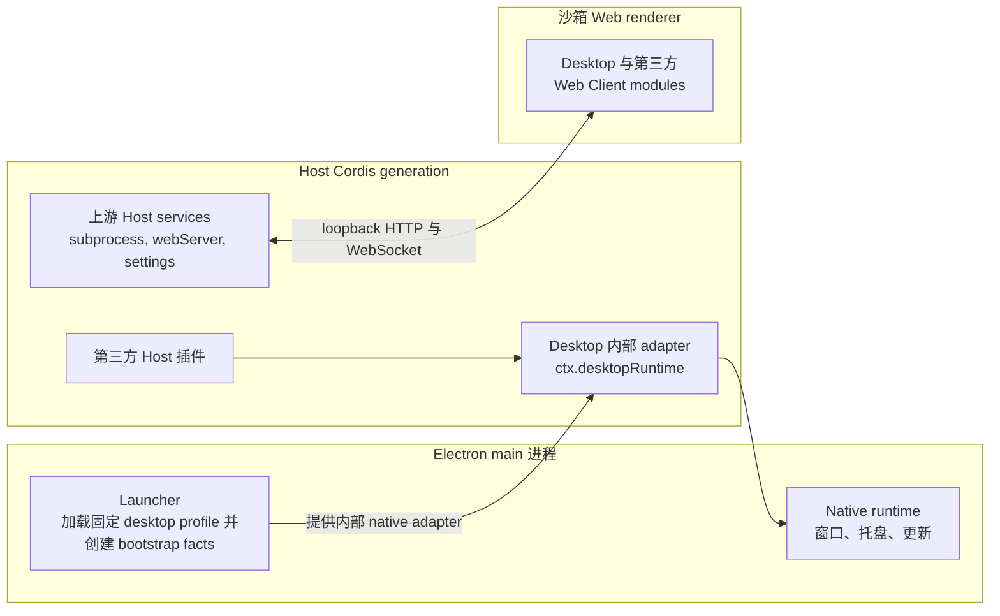

# PicoAide Harness 插件 service

[English](plugin-services.md) | 中文

本文档是面向插件作者、受支持的 Host 侧集成 contract。PicoAide Harness 2.x 运行固定的 `desktop` profile 与高级平台原生呈现。它不会授予第三方访问原始 Electron API、renderer 或 launcher bootstrap 状态的能力。

## 分层与数据流



Launcher 在 Loader tree 挂载前加载固定 profile。托盘中没有 profile 选择器，也没有模式切换。service 引用不能跨越 Cordis generation 边界。

renderer 通过现有 loopback carrier 接收普通 Web Client modules。它无法直接读取这些 Host services，PicoAide Harness 也没有为它们添加 preload 或 Electron IPC bridge。带浏览器 UI 的插件继续使用普通 DSH Host routes、RPC、client metadata、services 与 slots。

## 内部能力

| 名称 | 边界 | 插件作者状态 |
| --- | --- | --- |
| `desktopRuntime` | Launcher 提供的 native adapter，供 Desktop 自有的 shell、诊断与更新 row 使用。 | Desktop 内部。第三方插件不得 inject 或依赖其 window/tray 方法。 |
| `desktopActions` | 只暴露 restart 操作的 generation 级 Host service。 | 通过 `dsh-plugin-desktop` 根入口公开；仅限显式用户操作。 |

Native tray 支持 Host 插件通过 `desktopRuntime.registerTrayItem` 提供 effect-scoped contribution。第三方插件可以贡献一个 `tools` 项，包含稳定 label 与 invocation；当该项的可观察状态变化时托盘菜单会自动重建。

## 注入模式

### Desktop-only 插件：托盘 contribution

只在 PicoAide Harness 内有意义的插件可以贡献原生托盘命令。Cordis 在 `desktopRuntime` 可用前保持插件 pending，provider 消失时卸载其 effects。

```ts
import type { Context } from '@deepseek-ai/cordis'
import type {} from 'dsh-plugin-desktop'

export const name = 'example-desktop-plugin'
export const inject = ['desktopRuntime']

export function apply(ctx: Context): void {
  ctx.effect(() => {
    const registration = ctx.desktopRuntime.registerTrayItem({
      group: 'tools',
      order: 30,
      label: () => 'Example Action',
      invoke: () => { /* 显式用户操作 */ },
    })
    return () => { registration.dispose() }
  }, 'dsh-plugin-desktop: example tray command')
}
```

`registerTrayItem` 返回可刷新的 registration handle。不要把它保留到所属 effect 生命周期之外。

## 失败与 teardown 清单

1. 把所有托盘 contribution 放在 Cordis `effect` 内，使 dispose 时移除它们。
2. 不要读取提供它的 generation 之外的 `ctx.desktopRuntime`。
3. 不要假设具体托盘 label 集合；Desktop 自有 label 可能变化。
4. `invoke()` 内处理异步失败；托盘 adapter 会记录错误。

## 当前 dshmarket 边界

`dshmarket@1.2.3` 先于本 contract。它选择 `config.profile`、随后 launcher argv、再 `web`；它私下 import `node:child_process`、发现裸 `dsh` 命令并自行运行 `dsh plugin --profile ...`。其公开 package exports 没有暴露 route 或 runner injection seam。外部 config patch 可以修正 profile 名，PATH shim 可以让其 legacy 命令可被发现。

因此 PicoAide Harness 不会预装或依赖该版本。后续兼容版本必须在普通 DSH 环境缺少 Desktop services 时保留现有 config/argv/CLI 路径，并避免把 Desktop services 作为跨环境包的必需顶层 injection。

另有独立再分发 gate。`1.2.3` 的 manifest 与 README 声明 MIT，但其源码仓库与 npm tarball 均未包含完整 MIT 许可文本或版权通知。直到新审计版本包含所需通知前，用户主动安装仍与 Desktop 把该包嵌入 application archive 或 installer 是两回事。

## 稳定性边界

受支持的插件作者 surface 是 `desktopRuntime` registration contract 与 `desktopActions` restart 能力。Launcher bootstrap 值、native adapters、生成的 shim、state-file 格式、Loader row 顺序与 Electron 实现细节都可能变化而不构成第三方 API。保持 fallback 显式、生命周期受限且 headless-safe。
